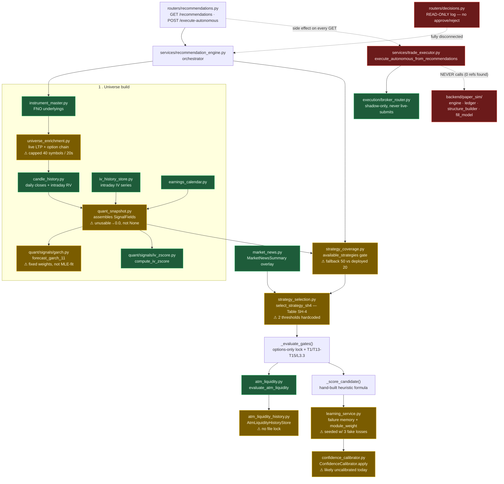
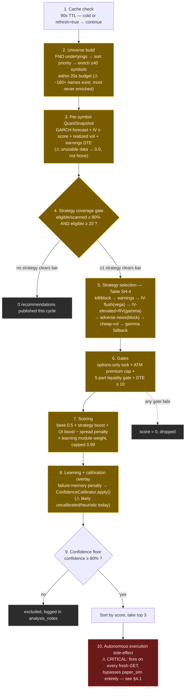
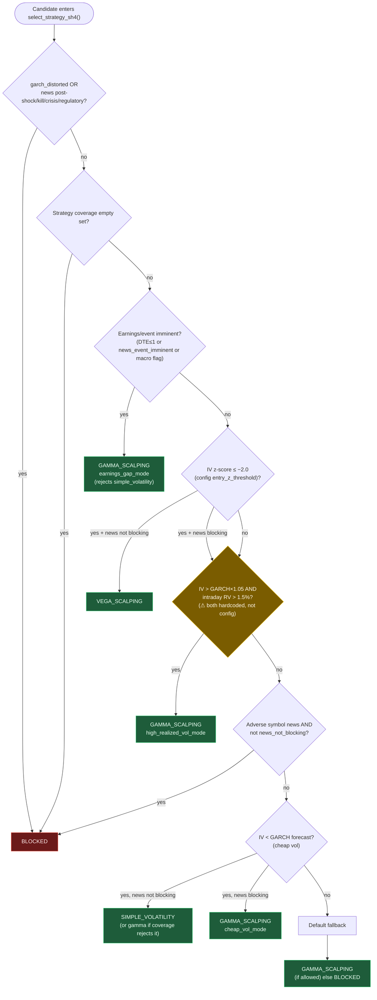
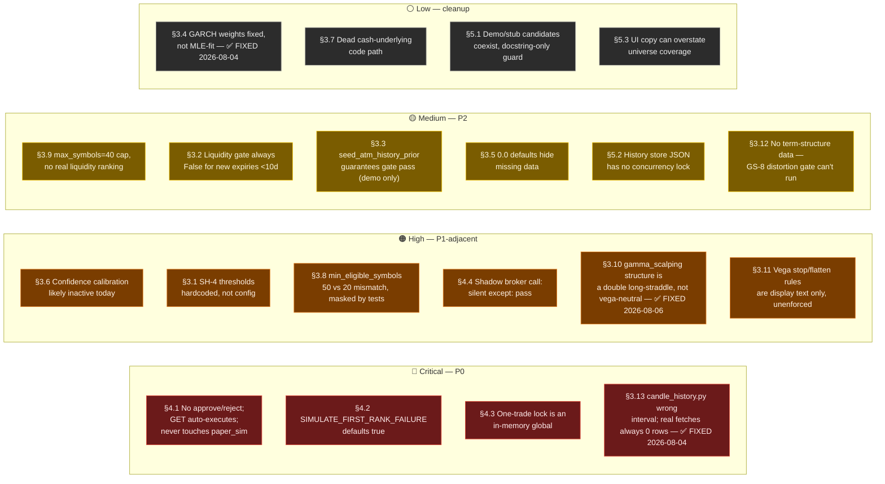

# Recommendation Engine — Full Audit & Improvement Tracker

Status: living document. Created 2026-08-03 by full-code audit (not doc-only) of the
recommendation engine and everything it touches, cross-checked against
`.cursor/rules/must-fix-before-claiming-performance.mdc` (P0–P2 priority order) and
`Docs/bot_health/BACKLOG.md`. Update this file as items are fixed — check items off,
never delete history (same convention as `Docs/bot_health/BACKLOG.md`).

**2026-08-03 update:** added §3.10–§3.12 after cross-checking the recommendation/
paper-sim code against the freshly-corrected `Docs/Trading_Strategies.md` (that doc's
own accuracy pass, same day, fixed its Table GS-4 mirror-construction description and
added Table GS-8's term-structure gate and Table VS-2's stop/flatten rules in fuller
detail — this pass checks whether the code matches what the doc *now* says).

Reviewed commit: `7017e92` (HEAD at audit time). Prod frontend spot-checked:
https://trading-bot-1-pi.vercel.app/recommendations (see §7).

---

## 1. What "the recommendation engine" actually is

Not one file — a pipeline of ~14 modules. Green = real/wired, yellow = real but
weak/untested/inactive, red = fake, disconnected, or dangerous (see §4).

`routers/decisions.py` is a **separate, read-only** log — it does not feed back into
this pipeline at all (see §4.1). The dashed red arrows are the two most important
lines in this whole diagram: `trade_executor.py` never calls `paper_sim`, and
`decisions.py` never calls anything — both are dead ends today.

---

## 2. Pipeline walkthrough (what happens on one `GET /api/v1/recommendations?refresh=true`)

1. **Cache check** — `recommendation_engine.py:848-861`. 90s in-process TTL
   (`response_cache_ttl_sec`). A plain page load without `refresh=true` just replays
   the last packet.
2. **Universe build** — `_build_universe()` (`recommendation_engine.py:276-439`):
   loads FNO underlyings from ICICI's `FONSEScripMaster`, sorts index/bank names to
   the front (`priority` dict, line 302-315), then enriches **at most 40 symbols**
   (`recommendation_universe_enrichment.max_symbols`) within a **20s wall-clock
   budget** via `UniverseEnricher.enrich_many` (rate-limited to ~1.43 calls/sec).
   Everything past the 40-symbol cut is simply never enriched this cycle — not a
   fallback path, the default and only path once the FNO universe (~180+ names)
   exceeds 40.
3. **Per-symbol QuantSnapshot** — GARCH(1,1)-shaped forecast (fixed weights, not
   fitted; §3.4), intraday IV z-score, realized vol, earnings DTE. Missing/invalid
   data collapses to `0.0` numeric defaults with a separate `usable`/`garch_distorted`
   flag that every downstream consumer must remember to check (§3.5).
4. **Strategy coverage gate** — `evaluate_strategy_coverage()` computes per-strategy
   `eligible/scanned` against `min_coverage_ratio=0.80` and `min_eligible_symbols=20`;
   only strategies clearing both are in `available_strategies`. If none clear, the
   whole cycle publishes zero recommendations (`recommendation_engine.py:1070-1074`).
5. **Strategy selection (Table SH-4)** — `select_strategy_sh4()` per candidate:
   kill/block → coverage pre-empt → earnings/event → IV flush (vega) → IV
   elevated+high RV (gamma) → adverse news (block) → cheap vol (simple_vol or
   gamma) → default gamma fallback. See §3.1 for the two hardcoded thresholds
   inside this otherwise config-driven module.
6. **Gates** — options-only hard lock (always true — cash-underlying path is fully
   dead code, §3.7), ATM premium cap, 5-part ATM liquidity gate (§3.2), DTE ≥ 10.
7. **Scoring** — `_score_candidate()` — a hand-built additive/multiplicative
   heuristic (base 0.5 + strategy boost + OI boost − spread penalty, × learning
   module weight, capped 0.99). Not a fitted/optimized ranking model.
8. **Learning + calibration overlay** — failure-memory penalty
   (`learning_service.py`) then `ConfidenceCalibrator.apply()` (§3.6).
9. **Confidence floor** — only `confidence >= 0.80` survives
   (`execution_constraints.min_recommendation_confidence`), then top-3 by score.
10. **Autonomous execution side effect** — `_recommendations_with_autonomous_execution()`
    (`routers/recommendations.py:38-50`) immediately calls
    `execute_autonomous_from_recommendations()` on every fresh (non-cached) cycle.
    This is the single most important finding in this audit — see §4.

### 2.1 Strategy selection (Table SH-4) decision order

---

## 2.2 All findings at a glance, by severity

---

## 3. Findings — quant/gating layer

### 3.1 Two SH-4 thresholds are hardcoded outside the config system — ✅ FIXED 2026-08-03
`backend/services/strategy_selection.py:283,285` — `realized_vol_intraday > 0.015`
(1.5%/day intraday RV) and `iv_annualized > garch_forecast * 1.05` are Python
literals, not `trading_parameters.defaults.json` entries, unlike every other
threshold in the same decision matrix (z-thresholds, DTE bounds, premium caps all
come from config). Tuning either requires a code change + redeploy, not a config
edit, and there's no doc citation pinning `0.015`/`1.05` to a specific
Trading_Strategies.md row.
- **Fix:** move both into `trading_parameters.defaults.json` under a
  `strategy_selection` section, matching the pattern used everywhere else in this
  file.
- **Resolution:** added `strategies.gamma_scalping.entry_signal` to
  `trading_parameters.defaults.json` (`high_realized_vol_intraday_threshold: 0.015`,
  `iv_elevated_vs_garch_multiplier: 1.05` — same numeric values, now config-owned)
  and updated `select_strategy_sh4()` in `strategy_selection.py` to read both from
  `cfg` instead of using literals. Behavior-preserving (values unchanged); unblocks
  future tuning/backtesting of this branch via config edit only. No numeric
  validation/backtest was performed as part of this fix — the values still have no
  doc citation pinning them to a specific Trading_Strategies.md number, only a
  config home now.

### 3.2 ATM liquidity gate is unconditionally False for the first 10 sessions of any expiry — ✅ FIXED 2026-08-03
`backend/services/atm_liquidity.py` — `rel_volume_ok`/`rel_oi_ok` required
`history_days >= min_history_days (10)`. A brand-new expiry (e.g., week 1 of a new
weekly/monthly series) could never pass liquidity gates regardless of how liquid it
actually was, because `evaluate_atm_liquidity` ANDs all 5 conditions including the
relative ones. Combined with `seed_atm_history_prior` (§3.3), this meant the
liquidity gate's realism depended entirely on which candidates got real history vs.
synthetic fabricated history.
- **Resolution:** `evaluate_atm_liquidity()` now runs a two-tier `relative_basis`:
  `n >= min_history_days` keeps the original temporal-average check unchanged;
  `n < min_history_days` falls back to a **same-session chain-relative** check —
  current ATM volume/OI vs. the median volume/OI of the `NEAR_ATM_PEER_WINDOW`
  (3-each-side) nearest strikes in the same option chain, computed in
  `universe_enrichment._near_atm_peer_medians()` from chain data that was already
  being fetched (`parse_atm_from_chain`) but previously discarded once the ATM
  strike was picked — no new Breeze API calls. New config key
  `option_universe_filters.chain_relative_min_ratio` (default `1.0`) governs the
  fallback threshold. Both the fallback engagement (`ATM_CHAIN_RELATIVE_MODE`) and
  a no-peer-data case (`ATM_CHAIN_RELATIVE_DATA_MISSING`) are surfaced as explicit
  reason codes — on pass or fail — so the audit trail never silently conflates the
  two bases. Threaded through `LiveMarks` → `QuantSnapshot` →
  `InstrumentCandidate` → `_evaluate_gates()` and the parallel `signals.py` path;
  `T13b`/`T14b` gate labels now say which basis was active. Absolute floors (T13/
  T14) and the spread gate (T15) are unchanged. Tests added in
  `test_atm_liquidity.py` (pass/fail/no-peer-data/established-expiry-unaffected)
  and `test_universe_enrichment.py` (median computation over window strikes); full
  backend suite (237 tests) passes.
- **Not addressed by this fix:** the peer window is a fixed module constant
  (`NEAR_ATM_PEER_WINDOW = 3`), not config-driven — deferred because plumbing it
  down to `UniverseEnricher` would need a config-loading dependency in a class that
  currently has none. §3.3's `seed_atm_history_prior` fabrication (demo-path only)
  is untouched.

### 3.3 `seed_atm_history_prior` fabricates history that is *guaranteed* to pass the relative gates — ✅ PARTIALLY FIXED 2026-08-03
`backend/services/signals.py` — `avg_vol = volume/1.6`, `avg_oi = open_interest/1.4`
are chosen so current volume/OI always clears the 1.5×/1.3× relative-average
thresholds. Used for the demo `GET /signals` path and for demo-fixture candidates
in `recommendation_engine.py` (`_DEMO_SPECS` / `_candidate_from_spec`). Also
hardcoded literal dates `"2026-01-{i:02d}"` — would have looked stale/wrong once
real sessions moved well past January 2026, if this path were ever exercised past
that window.
- **Confirmed scope:** only wired into the demo/offline-fixture path
  (`_candidate_from_spec`, docstring says "Test/offline fixture helper only — not
  used for production ranking") — **not** the live-enriched path, which uses
  `AtmLiquidityHistoryStore.prior_points()` for real history. Low risk today, but
  worth a test asserting the demo path never leaks into `_build_universe()`'s
  production candidate list, since that invariant currently rests on code
  discipline, not an enforced boundary.
- **Resolution:** (1) `seed_atm_history_prior` now generates `session_date` values
  relative to today (`datetime.now(timezone.utc).date() - timedelta(...)`) instead
  of hardcoded `2026-01-*` strings — no longer goes stale. (2) Added
  `test_demo_fixture_helpers_are_tagged_and_never_called_from_build_universe` to
  `backend/tests/test_recommendation_engine.py`: inspects `_build_universe`'s
  source and asserts it never references `_candidate_from_spec`, `_demo_universe`,
  `_stub_candidate`, or `_DEMO_SPECS`, plus sanity-checks that the demo/stub
  helpers really do tag `marks_source` as `"demo"`/`"stub"` (so the guard isn't
  vacuous). This makes the "demo path never leaks into production ranking"
  invariant machine-checked instead of docstring-only — same fix class as §5.1.
  **Not yet done:** the gate-gaming math itself (`/1.6`, `/1.4` divisors) is
  unchanged — this fix closes the *leak* risk and the *staleness* risk, not the
  underlying "fabricated history always passes" property, which is by design for
  a fixture helper that must never reach production candidates.

### 3.4 GARCH(1,1) forecast uses fixed, unfitted weights — not MLE-estimated — ✅ FIXED 2026-08-04
`backend/quant/signals/garch.py` — was `gamma=0.05, alpha=0.05, beta=0.9` config
constants applied to every symbol identically, not parameters fit to each
symbol's own return series via maximum likelihood. Also, `VL` (long-run
variance) was computed as `mean(r²)`, treating returns as zero-mean rather
than subtracting the sample mean first.
- **Resolution:** `fit_garch_11_mle()` fits `(γ,α,β)` per symbol via
  `scipy.optimize.minimize` (SLSQP) when there are ≥ `fit_min_observations`
  (default 60, config `garch_forecast.fit_min_observations`) log returns;
  between `min_observations` (20) and that floor, the fixed weights above
  remain the deliberate fallback (`fitted=False`, not distorted — same
  behavior as before this fix). A non-converged/degenerate fit at or above
  the floor now fails closed: `garch_distorted=True`,
  `reason="garch_fit_failed"`, rather than silently reusing fixed weights.
  `VL` now uses mean-centered sample variance, applied on both the fit and
  fallback paths. `GarchForecastResult.fitted`/`.gamma_used`/`.alpha_used`/
  `.beta_used` make it observable, per forecast, whether the weights were
  actually fit, and are now logged (`quant_snapshot.py`, `logger.debug`) per
  symbol per cycle. See `Docs/superpowers/specs/2026-08-04-garch-mle-fit-design.md`
  and `backend/tests/quant/test_garch.py`.
- **Ships disabled by default:** the final whole-branch review found that on
  realistic ~60–90-observation series (the range this bot actually sees per
  symbol), the MLE fit frequently converges to degenerate boundary solutions
  (weights pinned near 0 or 1, e.g. γ≈1/α≈β≈0) that can swing `σ_annual` by
  up to 30% on estimation noise alone — directly moving the `IV < σ_annual`
  cheap-vol gate with no out-of-sample validation behind it. Per this repo's
  P1 rule (no unvalidated changes to the vol edge), `garch_forecast.enable_mle_fit`
  defaults to `false` in `trading_parameters.defaults.json` (and the
  `quant_snapshot.py` call site also defaults to `False` if the key is
  omitted), so production behavior is unchanged from before this fix until
  walk-forward/OOS evidence justifies turning it on.
- **Walk-forward evidence gathered 2026-08-04:** `Docs/bot_health/garch_mle_walk_forward_evidence.md`
  (method + code: `backend/quant/analytics/garch_walk_forward_validator.py`,
  `backend/scripts/backfill_daily_price_history.py`,
  `backend/scripts/run_garch_walk_forward_validation.py`). 1,788 pooled
  out-of-sample days across the pilot universe (NIFTY, BANKNIFTY, RELIANCE,
  HDFCBANK, INFY; ~2.5 years of real Breeze daily closes each), rolling
  250-day window, QLIKE-scored. Result: the MLE fit essentially ties the
  fixed-weight fallback (50.7% combined win rate, mean QLIKE −7.9202 fitted
  vs −7.9207 fixed — not a meaningful difference) — no forecast-accuracy
  edge found. **Recommendation stands: keep `enable_mle_fit: false`.** This
  is a real result, not just a defensive default anymore, though it's worth
  re-running periodically as more history accumulates rather than treated as
  final.
- A single |log-return| > 25% anywhere in the 60-day lookback (`detect_price_gaps`,
  hardcoded `max_return_abs=0.25`) sets `garch_distorted=True` for the *whole*
  window, with no distinction between "one stale bad print 55 days ago" and "a real
  shock yesterday." Conservative and safe, but can silently starve a name of
  cheap-vol/vega eligibility for its entire 60-day lookback after a single vendor
  data glitch.

### 3.5 `snapshot_to_candidate_fields()` defaults unusable numeric fields to `0.0`, not `None`
`backend/services/quant_snapshot.py` — `iv_annualized`, `garch_forecast`,
`und_price` all collapse to `0.0` when unusable, distinguishable only via the
separate `garch_distorted` flag. Any future code path that reads these fields
without also checking usability will silently treat "no data" as "legitimately
zero" — e.g. `iv_annualized < garch_forecast` becomes `0 < 0 = False`, quietly
routing away from the cheap-vol branch with no diagnostic. `price_history` defaults
to `[1.0]` (a single-point list) rather than `[]`, which is falsy-safe but produces
degenerate zero-variance behavior if ever iterated over without a length check.
- **Fix:** consider `NaN`/`None` sentinels instead of `0.0`, or at minimum, assert
  in `_score_candidate`/`_select_strategy` that `garch_distorted` is checked before
  any of these three fields are used arithmetically (may already be true in
  practice — worth a targeted unit test that a `garch_distorted=True` /
  `iv_annualized=0.0` candidate never scores > 0).

### 3.6 Confidence calibration is architecturally real but very likely inactive today
`backend/services/confidence_calibrator.py` + `services/learning_service.py`. The
plumbing is genuine: every trade close calls `_maybe_refit_confidence_calibration`,
which attempts to fit and — only if a walk-forward check inside
`analytics/confidence_calibration.py` passes — deploy a new
`confidence_calibration.json`. Until that file exists with `"deployed": true`,
`ConfidenceCalibrator.apply()` returns the **raw, uncalibrated** score
(`calibration_status="uncalibrated"`, `confidence_source="heuristic"`) — which,
given 0 real closed trades per module today (see `Docs/bot_health/STATE.md`), is
almost certainly the live state right now. This is honestly surfaced in the API
(`calibration_status` field), not hidden — but any "confidence = P(win)" framing in
UI copy or user-facing language is not true yet.
- Refit failures are swallowed by a bare `except Exception: return` with no log
  line (`# noqa: BLE001`) — a real refit bug would be completely invisible. Add at
  minimum a `logger.warning`.
- **No test file exists** for this module at all — `reload()`'s validation branch,
  `apply()`'s per-strategy-vs-global fallback, and the uncalibrated default path
  have zero regression coverage.

### 3.7 The "includes_underlying" / cash-leg code path is fully dead
`recommendation_engine.py:442-453` — `_structure_uses_underlying()` always returns
`False` and `_prefer_options_only_for_high_spot()` is a documented no-op ("legacy
callers"). Every recommendation is options-only by construction, which is correct
and matches the options-only invariant Guruji checks — but the dead
parameters/branches (`includes_underlying`, `force_options_only`) threaded through
`_evaluate_gates`, `_build_logic_trail`, `_hedge_insight` add real cognitive load
for zero behavior difference today.
- **Fix (cleanup, not urgent):** either delete the dead parameters or leave a single
  comment at the top of the file explaining they're a kept-for-future-underlying-
  support seam — currently there's no note explaining why dead code was kept.

### 3.8 `strategy_coverage.py` fallback default (50) disagrees with deployed config (20) — and every test hardcodes 50
`backend/services/strategy_coverage.py:95` — `int(section.get("min_eligible_symbols",
50))`. The actual deployed value in `trading_parameters.defaults.json` is **20**.
If the config section is ever emptied/misconfigured, the code silently falls back
to a *stricter* floor than intended. Worse: `backend/tests/test_strategy_coverage.py`
hardcodes `"min_eligible_symbols": 50` in nearly every test fixture (lines 62, 74,
83, 92, 109, 117) — meaning **a regression that changed the deployed default away
from 20 would not be caught by this suite**, since the tests never exercise the
real default at all. Only `test_fno_universe.py:136` and one case in
`test_strategy_coverage.py:133/154` use `min_eligible_symbols: 1` or `20`.
- **Fix:** align the in-code fallback to `20` (or remove the magic-number
  discrepancy by requiring the config key), and add one test that loads the real
  `trading_parameters.defaults.json` unmodified and asserts coverage behavior
  against the actual shipped default.
- **Resolution 2026-08-08:** the magic number is gone rather than aligned.
  `strategy_coverage.py` no longer has a `min_eligible_symbols` fallback at all —
  it calls `scan_capacity(cfg)` (`backend/services/scan_capacity.py`), which
  derives the floor as `ceil(min_coverage_ratio × derived_scan_cap)`. A config
  section that is emptied therefore yields the *derived* floor, not a stricter
  magic constant, and there is no second place for the number to drift.
  `backend/tests/test_scan_capacity.py::test_shipped_defaults_are_satisfiable`
  loads the unmodified `trading_parameters.defaults.json` and asserts the real
  shipped behaviour, which no test previously did.

### 3.9 `max_symbols=40` truncation has no visible liquidity/importance ranking beyond a short manual priority list — ✅ PARTIALLY FIXED 2026-08-06
`recommendation_engine.py:301-319` — only 12 symbols (indices + a handful of large
caps) get explicit priority; the remaining ~28 of the 40-symbol budget are filled
alphabetically from whatever's left in the FNO master. With NSE F&O covering
~180+ underlyings, the majority of the tradeable universe is never enriched, every
single cycle — not just under load. This directly caps `universe_scanned` and
interacts tightly with `min_eligible_symbols=20` (already more than half of 40) —
a handful of enrichment failures among the 40 attempted can tip coverage below the
gate.
- **Fix:** rank the 40-symbol budget by a real liquidity/ADV proxy (e.g., prior
  session's OI/volume from `AtmLiquidityHistoryStore`) instead of a short hardcoded
  allowlist + alphabetical order, or raise `max_symbols` if the 20s budget has
  headroom (would need to be checked against Breeze's ~100/min, ~5000/day caps).
- **Resolution:** `AtmLiquidityHistoryStore.latest_liquidity_by_underlying()`
  (`backend/services/atm_liquidity_history.py`) returns each underlying's most
  recent ATM volume+OI across any expiry_key, as a liquidity proxy. A new pure
  `_rank_symbols_for_enrichment()` (`backend/services/recommendation_engine.py`)
  replaces the old `sorted(symbols, key=lambda s: (priority, alphabetical))`:
  the explicit priority names (indices/large caps) still sort first unchanged,
  but everything else now sorts by this liquidity proxy descending, falling
  back to alphabetical only when a symbol has no history yet (a cold store, or
  a name genuinely never enriched before, defaults to `0.0` for all — so
  ordering is provably unchanged from today until real sessions accumulate;
  covered by `test_rank_symbols_for_enrichment_falls_back_to_alphabetical_with_no_history`).
  Tests: `backend/tests/test_atm_liquidity_history.py` (aggregation across
  expiry keys, most-recent-session tiebreak, underlying filter) and
  `backend/tests/test_recommendation_engine.py` (priority-first, liquidity-desc
  ordering, cold-store fallback, mixed known/unknown symbols). Full backend
  suite (319 tests, was 301) passes. **Not addressed by this fix:** `max_symbols`
  itself is still 40 — this only improves which 40 get picked, it doesn't raise
  the cap (that's a separate, still-open call against Breeze's rate envelope).
- **Resolution 2026-08-08 (the "separate, still-open call" above):** `max_symbols`
  no longer exists as a config key. `backend/services/scan_capacity.py` derives
  the cap as `min(wall-clock capacity, daily-envelope capacity)` — 23 underlyings
  on shipped defaults — explicitly *against* Breeze's ~100/min and ~5000/day
  envelope (3381 calls/day at a 900s cadence), and `validate_scan_capacity()`
  refuses to boot if the arithmetic does not hold. This also names the root cause
  of §3.1's empty recommendations: 40 symbols × ~5 paced calls × 700ms ≈ 140s
  never fitted the old 20s budget, so every scan truncated below the coverage
  gate and nothing raised. The ranking work above still decides *which* symbols
  fill the derived cap.

### 3.10 The "gamma_scalping" four-leg structure is a double long-straddle, not the vega-neutral calendar spread `Trading_Strategies.md` Table GS-4 requires — ✅ FIXED 2026-08-06
`backend/paper_sim/structure_builder.py:128-256` (`_append_opposite_option_at_strike` +
`_append_second_strike_option_pair`) builds the gamma-scalping opening basket as:
CE + PE at the entry strike, **plus** CE + PE at a second nearby strike — all four
legs using `first.side` (the same side as the entry leg; confirmed by grep, no `SELL`
literal appears anywhere in the file) and all four legs resolved against
`record.expiry` (confirmed: the function never fetches or requests a second,
longer-dated expiry — `feed.list_options(... expiry=record.expiry ...)` is the only
expiry used throughout).

This does not match Table GS-1/GS-4 at all: the strategy's entire thesis is
short-dated **long** calls/puts offset by longer-dated **short** calls/puts at the
*same* strike (mirrored quantities, per the delta identity in GS-4 step 4), which is
what keeps the book vega-neutral while gamma stays positive. What the code actually
opens is a long straddle at strike A plus a long straddle at strike B, same expiry,
same side — i.e., **more long vega and long gamma, with nothing short anywhere**.
That is functionally the Simple Volatility Trading structure repeated at two
strikes, not Gamma Scalping. Every "gamma_scalping" position taken by this bot today
is carrying full, unhedged vega exposure that the strategy's own name and Greek
Profile Target (Table GS-2: vega ≈ 0) say it should not have.
- **Fix:** rewrite `build_intended_legs_from_entry`'s `gamma_scalping` branch to (a)
  resolve a genuinely longer-dated expiry for the offsetting legs (not `record.expiry`
  again), and (b) flip those legs' side to `SELL`, sized to neutralize vega per the
  GS-4 mirror rule, rather than adding a same-side second strike. This is a
  correctness bug, not a documentation gap — the current code cannot produce the
  Greek profile the strategy is named for.
- **Resolution:** `backend/paper_sim/structure_builder.py` now builds vega-neutral
  gamma-scalping via `_append_vega_neutral_far_dated_pair()`, which (1) fetches a
  genuinely longer-dated far expiry via config-driven gap
  (`strategies.gamma_scalping.calendar_construction.long_expiry_min_gap_days`,
  default 28 days), (2) applies BSM vega-neutrality sizing to near+far leg pairs
  with mirrored put/call quantities, (3) sells the far-dated legs (opposite side
  from the near-dated long entry), and (4) fails closed to a near-dated straddle
  only when far-expiry data is missing or the configured gap cannot be met. Tests
  in `backend/tests/test_structure_builder.py` cover both the vega-neutral calendar
  construction and the fallback path when far expiry is unavailable. A
  `vega_neutral_tolerance` config gate (default 0.5) additionally fails the
  structure closed — falling back to the near-only straddle — when the achievable
  integer-lot solve can't clear that residual-vega threshold, which is common at
  the fixed 1-lot production entry size for less-favorable near/far DTE pairings;
  this is a deliberate, conservative, not-yet-backtested default (same precedent
  as this repo's `garch_forecast.enable_mle_fit`).

### 3.11 Vega scalping's stop-loss and same-session flatten rules exist only as display text — nothing in `paper_sim/automation.py` enforces them
`stop_z_threshold` / `stop_z_threshold_alt` (`-3.0σ`/`-4.0σ`) and
`flatten_at_session_close: true` are real config keys
(`trading_parameters.defaults.json:182-185`), but a repo-wide grep for both names
shows they are read in exactly one place: `recommendation_engine.py:822-827`, to
build a **pre-approval packet string** — `f"Stop: {v['iv_signal']['stop_z_threshold']}σ.
Flatten at session close"`. Nothing in `backend/paper_sim/automation.py` (the module
that actually manages open positions) re-checks live IV z-score against either stop
threshold, and a repo-wide grep for `session_close`/`market_close`/`EOD` inside
`backend/paper_sim/` returns **zero matches**. The automation loop's only exit
triggers are news-driven (`news_action in {kill_event, early_exit, take_profit}`,
`automation.py:319`) — there is no time-of-day check and no IV-mean-reversion check
at all.

**Superseded 2026-08-05:** news-driven exits (`kill_event`, `early_exit`, and the rest
of `post_entry_news_action`) were removed from `automation.py` entirely per operator
decision — market news now only blocks new entries (SH-4), never closes or flattens
an open position. That closes off the one exit trigger described above, so the
underlying gap this finding raised (no time-of-day flatten, no IV-mean-reversion
stop) is now total, not partial: `automation.py`'s only remaining exit paths are the
strategy exit rules and the mechanical γ–θ re-hedge. See
`Docs/superpowers/specs/2026-08-05-market-news-quality-killswitch-removal-design.md`.

Table VS-2 rules 6–7 and Table SH-3's "Session close always" row are treated by
`Trading_Strategies.md` as hard, non-optional constraints specifically because vega
scalping is defined as intraday-only with theta "largely ignored" on the assumption
the trade never survives to pay it. As implemented, a vega-scalp position has no
automated mechanism forcing it flat by end of session, and no automated mechanism
taking profit at mean-reversion or cutting losses at −3σ/−4σ — an operator would have
to do all three manually.
- **Fix:** add two checks to `paper_sim/automation.py`'s per-cycle loop for any open
  `vega_scalping`-tagged position: (a) flatten unconditionally once the session-close
  cutoff is reached, and (b) compute current IV z-score and flatten/take-profit at
  the config-driven mean-reversion / stop thresholds, instead of only surfacing those
  numbers as approval-packet copy.

### 3.12 Gamma scalping's term-structure distortion gate (Table GS-8) has no data to evaluate — `QuantSnapshot` carries only one `iv_annualized` value
`backend/services/quant_snapshot.py:28` — `QuantSnapshot.iv_annualized` is a single
scalar (near-month/ATM), with no second field for a longer-dated expiry's IV.
`strategy_selection.py`'s gamma-scalping branches (`high_realized_vol_mode`,
`cheap_vol_mode`, earnings-gap) never compare short-dated vs. long-dated IV — there
is nothing in the codebase that could, since the data model doesn't carry a second
expiry's IV at all (confirmed by reading `quant_snapshot.py` in full and grepping for
`near_iv`/`far_iv`/`term_structure` across `backend/`).

`Trading_Strategies.md` Table GS-8 calls term-structure distortion the strategy's
"hidden loss source" — a book can be vega-neutral at entry and still lose money if
short-dated IV is locally rich while long-dated IV is locally cheap, because the
spread itself mean-reverts. That check is currently impossible to run, so every
gamma-scalping entry is exposed to a risk the source material explicitly warns is
not covered by vega-neutrality alone. This compounds §3.10: the code isn't
vega-neutral in the first place, and even if it were, there's no gate against the one
loss mode that survives vega-neutrality.
- **Fix:** extend `QuantSnapshot` (or a sibling snapshot for the second expiry used
  in `structure_builder.py`) to carry both expiries' IV, and add a
  `iv_long_expiry >= iv_short_expiry` (or equivalent no-inversion) gate to
  `strategy_selection.py`'s gamma_scalping branches before selection, matching Table
  GS-8's "reject or reduce size" rule.

### 3.13 CRITICAL — `candle_history.py` passed `interval="1day"` to Breeze; every real daily-close fetch silently returned zero rows — ✅ FIXED 2026-08-04
`backend/services/candle_history.py:60` (`fetch_daily_closes`, used by GARCH and by
this doc's own walk-forward evidence work) called ICICI's `get_historical_charts`
with `interval="1day"`. Breeze's daily-interval endpoint only accepts
`"minute"`, `"5minute"`, `"30minute"`, or `"day"` — verified live: the buggy
value returns HTTP 200 with `{"Error":"Interval should be either 'minute',
'5minute', '30minute', or 'day'."}`, which the `except Exception` in
`fetch_daily_closes` silently swallows and returns `[]`. There was no test file
for `candle_history.py` at all, so nothing caught this. This means every real
(non-seeded, non-demo) daily-close fetch has likely never returned real data in
production — GARCH forecasts on real symbols have probably been falling into
`insufficient_history`/`garch_distorted` this whole time, not because of thin
history, but because the fetch itself always failed.
- **Resolution:** changed `interval="1day"` to `interval="day"`
  (`candle_history.py:60`). Verified live against Breeze: NIFTY now returns
  336 real daily closes for a 250-day lookback request (previously 0). Added
  `backend/tests/test_candle_history.py` — asserts the exact interval string
  passed for both `fetch_daily_closes` (`"day"`) and `fetch_realized_vol_intraday`
  (`"5minute"`, confirmed correct and untouched) against a recording fake
  adapter, so a regression here fails a unit test instead of only failing
  silently against the live API.

---

## 4. Findings — execution / integrity layer (P0-relevant — read this section first)

### 4.1 CRITICAL — There is no approve/reject step; `GET /recommendations` auto-executes a "trade"; nothing touches `paper_sim`
This is the sharpest gap in the whole engine and directly the subject of
`.cursor/rules/must-fix-before-claiming-performance.mdc` P0 item 1.

- `routers/recommendations.py:38-50` (`_autonomous_execution_for`) runs on **every
  fresh (non-cached) cycle** of `GET /api/v1/recommendations` — a plain page load
  with `refresh=true`, or any cold-cache hit, executes
  `execute_autonomous_from_recommendations()` as a side effect of a GET request.
  A naive uptime monitor or accidental double-click on "refresh" can open a
  "trade."
- `services/trade_executor.py` does this **entirely in module-level Python
  globals** (`_one_trade_locked`, `_active_trade_id` — lines 18-19, explicitly
  commented `"replaced by PostgreSQL in full implementation"`) and **never
  imports or calls anything in `backend/paper_sim/`** (confirmed by grep — zero
  matches). `_simulate_broker_submit()` fabricates a `trade_id` string and returns
  `order_status="filled"` unconditionally on the "success" path (line 161) — there
  is no fill/reconcile state, no ledger row, nothing durable. A process restart
  loses the one-trade lock and the "open" trade with no record it ever existed.
- `execution_constraints.supervised_approval_required = true` in
  `trading_parameters.defaults.json` is **not read anywhere** in
  `trade_executor.py` or `routers/recommendations.py` (confirmed by grep across
  both files — zero references). The config flag is dead: there is no code path
  that branches on it. Whatever "supervised" is supposed to mean today, it isn't
  enforced.
- `routers/decisions.py` is explicitly documented as **"Read-only decision log
  (Phase 0) — no approve / reject transitions yet"** and exposes only
  `GET /decisions`, `GET /decisions/pending`, `GET /decisions/{id}`. It has zero
  write capability and is completely disconnected from the auto-execution path in
  §4.1 above — it is not "the approval gate that's just unwired," it doesn't exist
  as a gate at all yet.
- **This is exactly `Docs/bot_health/BACKLOG.md`'s open P0 item** ("Build real
  `POST /approve` and `POST /reject` endpoints... make `paper_sim` ledger the
  single source of truth") — this audit adds concrete evidence: the auto-execution
  path in `trade_executor.py` is the thing that must be re-pointed at `paper_sim`,
  and `decisions.py` is the router that needs the real POST endpoints.

### 4.2 CRITICAL — `SIMULATE_FIRST_RANK_FAILURE` defaults to `true`, permanently faking a broker rejection for rank #1 — ✅ FIXED 2026-08-04
`backend/services/trade_executor.py:58-70` — `os.getenv("SIMULATE_FIRST_RANK_FAILURE",
"true")` — **the default, in the absence of any env var, is to always fail the #1
ranked recommendation** with a fabricated error message ("Broker reject: vega scalp
structure — insufficient liquidity at session open") and fall through to rank #2.
This reads like a demo/test scaffold that ended up as the production default. Any
environment that hasn't explicitly set `SIMULATE_FIRST_RANK_FAILURE=false` —
including, presumably, prod — is silently never executing on its own top-ranked
recommendation, and the "insufficient liquidity" message is not a real market
observation, it's a hardcoded string.
- **Fix:** flip the default to `false` (or remove the flag entirely and make it
  test-only via dependency injection/monkeypatch), and verify current prod env vars
  in Railway to see whether this has been silently shaping which recommendations
  ever "execute."
- **Resolution:** removed the `SIMULATE_FIRST_RANK_FAILURE` env var entirely —
  `os.getenv` is no longer read for this behavior anywhere in `trade_executor.py`.
  `_simulate_broker_submit()` and `execute_autonomous_from_recommendations()` now
  take an explicit keyword-only `simulate_first_rank_failure: bool = False`
  parameter; production call sites (`routers/recommendations.py`, both the `GET
  /recommendations` cycle and `POST /execute-autonomous`) don't pass it, so it's
  structurally impossible for prod to reach the simulated-rejection branch — there
  is no environment configuration that can turn it back on. The rank-1-rejects/
  fallback-to-rank-2 path is now exercised only via direct dependency injection in
  a new `backend/tests/test_trade_executor.py` (3 tests: default never simulates a
  failure, setting the old env var is now provably inert, and the injected-`True`
  path still falls through to rank #2 with the fabricated broker-reject message
  intact for that test scenario). Full backend suite (244 tests, was 241) passes.
  `Docs/architecture.md`, `Docs/eval.md`, `Docs/edge_cases.md` updated to drop the
  env-var-based soak/test instructions in favor of the DI-based approach.

### 4.3 One-trade lock and active-trade-id are in-memory globals — no restart survival
`trade_executor.py:18-19` — matches the already-open Guruji/backlog P0 item on
kill-switch/position-book persistence, but scoped specifically to the
recommendation-engine's autonomous execution path: a process restart mid-"trade"
loses all record that a position was ever opened, with no reconciliation step to
notice the discrepancy.

**Superseded 2026-08-05:** the kill-switch mechanism itself was removed entirely per
operator decision — the bot now has no manual kill switch. Only the
active-trade-id/one-trade-lock restart-survival half of this item remains open. See
`Docs/bot_health/BACKLOG.md` and
`Docs/superpowers/specs/2026-08-05-market-news-quality-killswitch-removal-design.md`.

### 4.4 Shadow broker-router call is fire-and-forget with a bare `except: pass`
`trade_executor.py:80-108` — the ICICI Direct shadow submit (`USE_ICICI_DIRECT_SHADOW`,
default `true`) wraps the entire broker-router call in `try/except Exception: pass`
with the comment "Shadow mapping failures must not block autonomous paper path" —
reasonable intent, but means **any bug in the shadow order-mapping path is
completely silent**, with no log line. Combined with §3.6's similarly-silent
calibration refit failure, this is a repeated pattern in the codebase of
swallowing exceptions with zero observability. Recommend at minimum a
`logger.warning(exc)` in both places — doesn't need to become fatal, just visible.

---

## 5. Findings — data quality / observability

### 5.1 Demo/stub candidate paths exist alongside the production path in the same module
`recommendation_engine.py` — `_DEMO_SPECS`, `_candidate_from_spec`,
`_stub_candidate`, `_demo_universe` are all clearly docstring-labeled
"not used for production ranking" / "non-ranking placeholder," and `_build_universe()`
(the actual production path) does not call any of them — confirmed by reading the
full function. Low risk today given the docstrings, but this is exactly the kind of
thing that erodes over time; a future refactor that merges paths without reading
every docstring could reintroduce fabricated candidates into ranking silently.
- **Fix (defensive, cheap):** one test asserting `_build_universe()`'s returned
  candidates never have `marks_source in {"demo", "stub"}` would make this
  invariant machine-checked instead of docstring-only.

### 5.2 `AtmLiquidityHistoryStore` has no concurrency guard on its JSON file
`backend/services/atm_liquidity_history.py` — plain read-modify-write on a JSON
file with no lock. Under concurrent async enrichment of multiple symbols/expiries
this is a classic race (last writer wins on a shared key); low real-world risk in a
single-process paper-trading deployment, but worth a comment or a per-key
async-lock if this ever moves to multi-worker deployment (Railway can run multiple
workers).

### 5.3 Coverage/enrichment note-lines are useful but the underlying numbers can be misleading if read casually
`recommendation_engine.py:1037-1049` — notes correctly disclose "Coverage
denominator: N enrichment-attempted underlyings (max_symbols/budget cap; not full
universe)" when capped — this is good, honest UI copy. But it means "universe
scanned: 40" in the UI can read as "the bot considered the whole market" to a
non-technical operator unless they read the caveat note carefully. No code change
needed, just flagging for anyone drafting user-facing copy/marketing language
about "scans the full NSE F&O universe."

---

## 6. Test coverage gaps (specific to this engine)

| Area | Status |
|---|---|
| `confidence_calibrator.py` | **No test file exists at all.** |
| `learning_service.py` | **No test file exists at all** — seeding, `record_outcome`, module-weight nudging, and the hardcoded `walk_forward_passed=True` adaptation event (`learning_service.py:605`) are all unverified by any test. |
| `strategy_coverage.py` real default (20) | Every test hardcodes `min_eligible_symbols: 50`; the shipped default is never exercised by the suite (§3.8). |
| `trade_executor.py` | No test file found under `backend/tests/` covering `_pre_submit_checks`, `_simulate_broker_submit`, `SIMULATE_FIRST_RANK_FAILURE` default behavior, or the one-trade-lock lifecycle. Given §4.1/§4.2, this is the highest-value place to add tests before touching the code. |
| `strategy_selection.py` | Individual SH-4 branches (earnings-gap, IV-flush, cheap-vol, blocked) are exercised indirectly via `test_recommendation_engine.py` fixtures but there's no dedicated `test_strategy_selection.py` walking all 8 decision-order branches explicitly. |
| `atm_liquidity_history.py` | One test (idempotent upsert + prior-excludes-today); no concurrency/race test, no `prune()` test. |
| `live_from_aggregated` (synthetic legs) | Not tested for "is this representative of real spreads" — see §3.3. |
| `structure_builder.py` gamma-scalping branch | No test asserts the four opened legs are vega-neutral or that any leg is `SELL` / on a longer expiry — a test doing so would have caught §3.10 directly. |
| `paper_sim/automation.py` vega-scalp exits | No test drives a vega-scalp position past session close or past the −3σ/−4σ stop to confirm it actually flattens — see §3.11. |

---

## 7. Prod spot-check (2026-08-03)

`https://trading-bot-1-pi.vercel.app/recommendations` at audit time showed:
- Status: **"Analyzing live feeds for top-3 recommendations…"** — no recommendations
  rendered.
- Daily P&L / win rate / drawdown / Greeks all at zero/default.
- NIFTY 50 / India VIX header metrics showing dashes (pending load).

Consistent with `Docs/bot_health/BACKLOG.md`'s already-closed "Live recommendations
empty on prod" item (resolved 2026-08-03 per that file) possibly still warming up,
or a fresh cold-cache cycle in progress. Not a new finding — noted here for
context, not actionable on its own. Re-check after a `refresh=true` cycle completes
to confirm the resolved fix is holding in prod, not just in tests.

---

## 8. Priority-ordered action list (P0 > P1 > P2, per the must-fix rule)

```mermaid
flowchart TD
    START(["Start here"]) --> P01

    subgraph P0["P0 — blocks any 'edge proven' claim"]
        direction TB
        P01["1. Route trade_executor.py through paper_sim;<br/>build real POST /approve, /reject in decisions.py;<br/>stop GET auto-executing (§4.1)"]
        P02["2. Flip SIMULATE_FIRST_RANK_FAILURE<br/>default to false (§4.2)"]
        P03["3. Persist one-trade lock +<br/>active-trade-id (§4.3)"]
        P01 --> P02 --> P03
    end

    P03 --> P1GATE{"Real closed trades<br/>now exist?"}

    subgraph P1["P1 — proof of edge (blocked until P0 done)"]
        direction TB
        P14["4. Confirm confidence_calibrator<br/>actually deploys a calibrated artifact (§3.6)"]
        P15["5. Move 2 hardcoded SH-4<br/>thresholds into config (§3.1)"]
        P111["11. Rebuild gamma_scalping structure as<br/>a real vega-neutral calendar spread (§3.10)"]
        P112["12. Enforce vega-scalp stop/flatten<br/>in automation.py, not just display text (§3.11)"]
        P14 --> P15 --> P111 --> P112
    end
    P1GATE -- yes --> P14

    subgraph P2["P2 — quality & cleanup (after P0/P1)"]
        direction TB
        P26["6. Fix min_eligible_symbols<br/>fallback/test mismatch (§3.8)"]
        P27["7. Add tests: confidence_calibrator,<br/>learning_service, trade_executor (§6)"]
        P28["8. Rank 40-symbol budget<br/>by real liquidity (§3.9)"]
        P29["9. Clean up dead cash-underlying<br/>code path (§3.7)"]
        P210["10. Add logger.warning to 2<br/>silent except blocks (§3.6, §4.4)"]
        P213["13. Add term-structure IV data +<br/>GS-8 no-inversion gate (§3.12)"]
        P26 --> P27 --> P28 --> P29 --> P210 --> P213
    end
    P112 --> P26

    classDef p0 fill:#6b1a1a,stroke:#e74c3c,color:#ffecec;
    classDef p1 fill:#7a3d00,stroke:#e67e22,color:#fff2e6;
    classDef p2 fill:#7a5c00,stroke:#f1c40f,color:#fff8e1;
    class P01,P02,P03 p0;
    class P14,P15,P111,P112 p1;
    class P26,P27,P28,P29,P210,P213 p2;
```

**P0 (blocks any "edge proven" claim — do these first):**
1. Wire `execute_autonomous_from_recommendations()` through `paper_sim` as the one
   ledger; make `routers/decisions.py` expose real `POST /approve` /
   `POST /reject`; stop `GET /recommendations` from auto-executing as a page-load
   side effect (§4.1). This is the single highest-leverage fix in this document —
   it is the concrete code-level form of the already-open P0 backlog item.
2. Flip `SIMULATE_FIRST_RANK_FAILURE` default to `false` (or remove it as a
   production-reachable flag) — as shipped, the bot is structurally biased against
   ever executing its own top pick (§4.2).
3. Make `_one_trade_locked`/`_active_trade_id` durable (file/DB), matching the
   already-open position-book persistence item (the kill-switch half of that item
   was closed by its removal — see §4.3 note) — this module is one of the concrete
   places the remaining half must land.

**P1 (proof of edge — blocked on P0-1 producing real trades):**
4. Once real trades exist, confirm `confidence_calibrator.py` actually deploys a
   calibrated artifact and stop describing `confidence` as P(win) until then (§3.6).
5. Move the two hardcoded SH-4 thresholds (§3.1) into config so regime-filter
   tuning (the existing P1 skew/term item) has a consistent home.
11. Rebuild the `gamma_scalping` opening structure in `structure_builder.py` as an
    actual vega-neutral calendar spread (offsetting legs on a genuinely longer
    expiry, sized and signed per Table GS-4) instead of a same-side, same-expiry
    second straddle — as shipped, every "gamma_scalping" trade carries full
    unhedged vega, contradicting the strategy's own Greek profile target (§3.10) —
    ✅ COMPLETED 2026-08-06.
12. Make vega scalping's stop-loss (config `stop_z_threshold`/`_alt`) and
    same-session flatten (`flatten_at_session_close`) real checks inside
    `paper_sim/automation.py`'s position loop — today they only render as
    approval-packet text and are never evaluated against a live position (§3.11).

**P2 (quality/cleanup — do after P0/P1):**
6. Fix the `min_eligible_symbols` fallback/test mismatch (§3.8).
7. Add tests for `confidence_calibrator.py`, `learning_service.py`, and
   `trade_executor.py` (§6) — currently the three modules with the most
   consequential undocumented behavior have zero regression protection.
8. Rank the 40-symbol enrichment budget by real liquidity instead of a short
   hardcoded allowlist (§3.9) — ✅ COMPLETED 2026-08-06.
9. Clean up or document the dead cash-underlying code path (§3.7).
10. Add a `logger.warning` to the two silently-swallowed exception paths (§3.6, §4.4).
13. Extend `QuantSnapshot` with a second (longer) expiry's IV and add the Table GS-8
    no-inversion gate (`iv_long_expiry >= iv_short_expiry`) to `strategy_selection.py`'s
    gamma-scalping branches (§3.12) — depends on #11 existing first, since there's no
    point gating a structure that isn't vega-neutral to begin with.

---

## 9. Open questions for follow-up

- Is `SIMULATE_FIRST_RANK_FAILURE` set explicitly in Railway's env vars today? If
  not, prod has been running with the fail-rank-1 behavior since deploy — worth
  confirming before assuming any live "execution" data reflects real rank-#1
  performance.
- **Resolved during this audit:** `backend/paper_sim/` is a fully separate, real
  system — `engine.py`, `ledger.py`, `structure_builder.py`, `fill_model.py`,
  `automation.py`, exposed via its own `routers/paper_sim.py`. A repo-wide grep for
  any reference to `recommendation`/`InstrumentRecommendation`/
  `generate_recommendations` inside `backend/paper_sim/` returns **zero matches**.
  So the answer is definitive: **two entirely disconnected trade-execution systems
  exist in this codebase today** — the real `paper_sim` engine (with an actual
  ledger and fill model) and the recommendation engine's own parallel, in-memory,
  no-ledger `trade_executor.py` (§4.1). Closing P0-1 means routing recommendation
  output into the *existing* `paper_sim` engine, not building a new ledger from
  scratch — `backend/paper_sim/` already has the pieces
  (`structure_builder.py`/`fill_model.py`) that `trade_executor.py` currently fakes
  with a bare `trade_id` string and `order_status="filled"`.
- What does `analytics/confidence_calibration.py`'s walk-forward "deploy" check
  actually require (sample size, OOS split)? Not read in this pass — relevant to
  both §3.6 and the P1 walk-forward backlog item.
