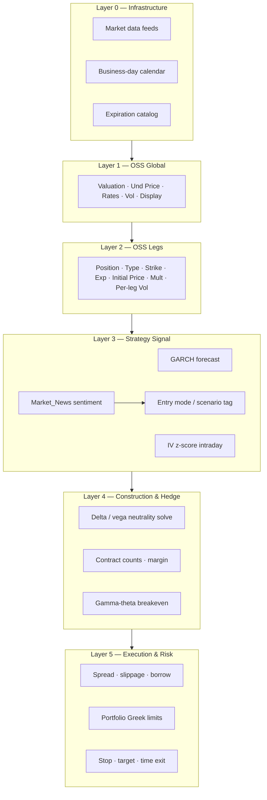

# Trading Parameters Reference

## Purpose

This document is the **complete, execution-ready parameter catalog** for the volatility-trading bot. It synthesizes three source references:

| Source | Role |
|---|---|
| `Docs/OSS_Guide (1).pdf` | Macroption Option Strategy Simulator (OSS) — input layout, BSM assumptions, formulas, Greeks conventions |
| `Docs/OSS (1).xlsm` | OSS workbook — cell mappings, default values, Iron Condor reference fixture, expiration catalog |
| `Docs/Trading_Strategies.md` | Consolidated playbook — Simple Volatility Trading, Gamma Scalping, Vega Scalping, shared framework |
| `Market_News.txt` | India news curation — sentiment / event keys in Part U; paper-sim and SH-4 overlay |
| `Docs/Paper_Simulator.md` | Paper path that consumes Parts H, J, K, U against ICICI Direct marks |

Every parameter listed below is required **either at trade construction (OSS inputs), at signal generation (strategy logic), or at execution/risk control**. Parameters are grouped by layer, then broken out per strategy.

**Options-only hard lock:** production, recommendation, paper, and live execution paths only construct and submit Call/Put option legs. `und_price` and `underlying_symbol` remain feed, chain-selection, ATM, and pricing inputs; they are not tradeable instruments. Stock legs are retained only for OSS parity / pricing tests and are rejected by bot execution with `OPTIONS_ONLY_REQUIRED`.

---

## Parameter Layer Overview



News curation contract: `Market_News.txt`. Strategy mapping: `Docs/Trading_Strategies.md` Table SH-4. Paper rehearsal: `Docs/Paper_Simulator.md`.
---

## Part A — OSS Global Parameters (Area 1)

These parameters apply to **every** option-based trade. They map to OSS main sheet rows 3–4.

| # | Parameter | OSS Cell | API Key (project) | Type / Units | Required | Description | Example (OSS xlsm) | Notes |
|---|---|---|---|---|---|---|---|---|
| A1 | **Valuation Date** | C3 | `eval_date` | Date | Yes | As-of date for pricing, P/L, Greeks, and DTE | 2024-01-04 | IST calendar day for NSE/NFO; often current session date; may be forward/back for what-if |
| A2 | **Valuation Time** | C4 | `eval_time` | Time | Yes | Intraday component; DTE uses datetime difference | 10:35:00 | **IST** (`Asia/Kolkata`); critical for intraday vega scalp and same-day flatten |
| A3 | **Valuation Datetime** | C3+C4 | `eval_datetime` | ISO 8601 | Yes (derived) | Combined convenience alias | 2024-01-04T10:35:00+05:30 | Must be **IST**; prefer explicit `+05:30` so DTE matches OSS parity fixture |
| A4 | **Underlying Price** | G4 | `und_price` | Decimal / share | Yes | Spot mark; same units as strikes | 85.40 | Live feed overrides default; refreshed each cycle |
| A5 | **Underlying Symbol** | — | `underlying_symbol` | String | Yes | Ticker that binds spot, chain, marks, ATM selection, and pricing inputs. It is **not** a tradeable leg in bot execution. | SBIN / NIFTY | Not in OSS UI; required by bot for feeds and chain lookup. Cash equities and indices are allowed when ATM, premium, and liquidity gates pass. |
| A6 | **Dividend Yield** | J3 | `div_yield` | Percent p.a., **continuously compounded** | Yes | Continuous yield q; also convenience yield / foreign rate (Garman–Kohlhagen) | 2.6% (0.026) | Set 0 for pure Black–Scholes; discrete dividends are a model limitation |
| A7 | **Interest Rate** | J4 | `int_rate` | Percent p.a., **continuously compounded** | Yes | Risk-free rate r; tenor ≈ option life | 4.0% (0.04) | Low sensitivity except long-dated / deep ITM structures |
| A8 | **Flat Volatility Flag** | Q3 | `flat_volatility` | Boolean | Yes | When true, one σ for all legs (O4); when false, per-leg σ in column Q | true | Disable flat vol when chain IV available per leg |
| A9 | **Volatility (flat)** | O4 | `volatility` | Percent p.a., annualized **std dev** (not variance) | Conditional | Global σ when flat vol on | 28.4% (0.284) | Vega defined per **1 vol point** (1% σ change) |
| A10 | **Display Mode** | L4 | `display_mode` | Enum: `per_share` \| `total` | Yes | How Value, P/L, Greeks totals render | `total` (L4=2) | Prefer `total` when leg sizes differ |
| A11 | **Default Option Contract Multiplier** | Y8 | `default_contract_multiplier` / `nfo_lot_sizing` | Integer or null | Yes | **India:** do **not** copy OSS Y8=`100`. Effective multiplier = each contract’s real NFO `lotsize` from ICICI Direct instrument master (`contract_multiplier_source=nfo_instrument_lotsize`). OSS workbook `100` is US equity/ETF parity / what-if only. | NFO lot from master (equity or index option) | Per-symbol NFO sizes differ and revise over time. |
| A12 | **Default Stock Contract Multiplier** | Y10 | `default_stock_multiplier` | Integer | OSS/test-only | Multiplier retained for OSS stock-leg parity fixtures only. | 1 | Rejected by bot execution; no cash NSE/BSE hedge legs are constructed or submitted. |

### A13 — Valuation Navigation (OSS UI; optional for bot)

| Control | OSS Location | Bot Equivalent |
|---|---|---|
| −1 week / −1 day / +1 day / +1 week | Row 3 buttons | `eval_datetime` offset helpers |
| Now | Row 4 | Set to current session datetime |
| Expiration | Row 4 | Jump to earliest leg expiration among active legs |
| Und price ±% / ±$ | G4 surrounds | Scenario / stress inputs |

### A14 — India NFO Lot Sizing (project rule; not an OSS cell)

| Key | Value | Rule |
|---|---|---|
| `contract_multiplier_source` | `nfo_instrument_lotsize` | Production + paper path |
| `nfo_lot_sizing.resolve_from` | `icici_direct_instrument_master` | Authoritative `lotsize` per resolved NFO contract |
| `nfo_lot_sizing.do_not_copy_oss_us_default` | `true` | Never apply OSS workbook Y8=`100` to India sizing |
| `nfo_lot_sizing.reference_equity_lots` | optional offline examples for equity NFO names | Docs-only; **live ICICI Direct `lotsize` always wins** |
| `default_stock_multiplier` | `1` | OSS parity / unit-test stock legs only; execution rejects stock legs |

Config artifacts: `backend/config/trading_parameters.defaults.json`, `backend/schemas/trading_parameters.schema.json`.

---

## Part B — OSS Leg Parameters (Areas 2 & 5)

OSS reference layout: rows 8, 10, 12, 14, 16 (five slots). **This project supports an unbounded leg list**; OSS five rows are not a cap.

| # | Parameter | OSS Col | API Key | Applies To | Type | Required | Description | Example (Leg 1, Iron Condor) |
|---|---|---|---|---|---|---|---|---|
| B1 | **Leg Index** | A | `leg_id` | All | Integer | Yes | Display / audit order; does not affect math | 1 |
| B2 | **Position** | B | `position` | All | Signed integer | Yes | + long, − short contracts/shares | +5 |
| B3 | **Expiration ID** | C | `expiration_id` | Call, Put | Catalog ref | Yes (options) | Index into expiration catalog | 6 → 2024-06-21 16:15 |
| B4 | **Days to Expiry** | D | `days_to_expiry` | Call, Put | Decimal days | Computed | Positive diff: expiration datetime − valuation datetime | 169.24 |
| B5 | **Strike** | E | `strike` | Call, Put | Decimal | Yes (options) | Same units as `und_price` | 75.00 |
| B6 | **Type** | F | `type` | All | Enum | Yes | `none`, `stock`, `call`, `put`; bot execution allows **only** `call` / `put` (`none` for empty OSS slots in tests) | `put` (F=4) |
| B7 | **Initial Price** | G | `initial_price` | All | Decimal / share | Recommended | Entry price per share; positive sign; include commissions | 3.60 |
| B8 | **Per-Leg Volatility** | Q | `leg_volatility` | Call, Put | Percent p.a. | Conditional | Required when `flat_volatility=false` | 28.4% |
| B9 | **Contract Multiplier Override** | S | `contract_multiplier` | All | Integer | Optional | Empty → NFO `lotsize` for options. Stock Y10 exists only for OSS parity fixtures. Never fall back to OSS US 100 on India path. | `lotsize` from master |
| B10 | **Effective Contract Size** | R | `effective_multiplier` | All | Computed | — | S if set, else ICICI Direct NFO `lotsize` for options; stock multiplier only in OSS parity tests | e.g. NFO `lotsize` |
| B11 | **Share Equivalent** | T | `share_equivalent` | All | Computed | — | `position × effective_multiplier` | lots × lotsize |
| B12 | **Leg Name** | V | `leg_name` | All | String | Computed | e.g. `+5 21Jun 75P` | +5 21Jun 75P |
| B13 | **Expiration Datetime** | U | `expiration_datetime` | Call, Put | Datetime | From catalog | Effective stop-trading datetime | 2024-06-21 16:15:00 |

### B14 — Type Encoding (OSS Lists sheet)

| OSS F value | Label | Default multiplier (India bot) |
|---|---|---|
| 0 / empty | None | — |
| 1 | Stock | 1 (Y10) — OSS parity / tests only; execution rejects |
| 3 | Call | NFO instrument `lotsize` (not OSS Y8=100) |
| 4 | Put | NFO instrument `lotsize` (not OSS Y8=100) |

### B15 — Stock Leg Rules

| Rule | Detail |
|---|---|
| Strike / expiration | Not applicable (grey in OSS) |
| Position | Shares (+ long, − short); e.g. −745 = short 745 shares |
| Greeks | Delta = ±1; gamma, theta, vega, rho = 0 |
| Use case | OSS parity / pricing tests only; never a production, paper, signal, recommendation, or broker leg |

### B16 — Initial Cash Flow (computed, column H)

```
initial_cf = −position × initial_price × effective_contract_multiplier
```

| Sign | Meaning |
|---|---|
| Negative | Cash outflow (typical long premium) |
| Positive | Cash inflow (typical short premium) |

Empty initial price → initial CF = 0; P/L equals position value.

---

## Part C — OSS Computed Outputs (Areas 3 & 4)

Not user inputs; **must be computed and persisted** for trade management, attribution, and risk gates.

| # | Output | OSS Col | API Key | Per-Leg | Portfolio Total (row 18) | Units / Convention |
|---|---|---|---|---|---|---|
| C1 | **Mark Price** | I | `mark_price` | Yes | — | Always per share; stock leg = `und_price` |
| C2 | **Position Value** | J | `value` | Yes | `total_value` | Respects display mode |
| C3 | **Profit / Loss** | K | `pnl` | Yes | `total_pnl` | `initial_cf + value` |
| C4 | **Delta** | L | `delta` | Yes | `total_delta` | $ change per $1 underlying move |
| C5 | **Gamma** | M | `gamma` | Yes | `total_gamma` | Δ change per $1 underlying move |
| C6 | **Theta** | N | `theta` | Yes | `total_theta` | Price change per **one calendar day** |
| C7 | **Vega** | O | `vega` | Yes | `total_vega` | Price change per **1 vol point** (1% σ) |
| C8 | **Rho** | P | `rho` | Yes | `total_rho` | Price change per **1 rate point** (1% r) |
| C9 | **Initial CF Total** | H18 | `total_initial_cf` | — | Sum | Iron Condor example: +1,850 |
| C10 | **First Expiration** | S18/U18 | `first_expiration` | — | Metadata | Earliest active leg expiry |

**Expired legs:** When valuation datetime ≥ expiration datetime, all option Greeks = 0.

**Iron Condor reference totals** (from `OSS (1).xlsm` at valuation **2024-01-04 10:35 IST** = `2024-01-04T10:35:00+05:30`, und=85.40; DTE ≈ 169.24 to 2024-06-21 16:15):

| Total Delta | Total Gamma | Total Theta | Total Vega | Total P/L |
|---|---|---|---|---|
| +0.81 | −2.93 | +2.19 | −28.18 | +258.34 |

---

## Part D — Expiration Catalog Parameters (`Expirations` sheet)

| # | Parameter | OSS Location | API Key | Type | Required | Description |
|---|---|---|---|---|---|---|
| D1 | **Expiration ID** | B (1–24) | `id` | Integer | Yes | Stable catalog key referenced by leg column C |
| D2 | **Expiration Date+Time** | C5–C28 | `expiration_datetime` | Datetime | Yes | **Effective** stop-trading moment (not always exchange label date) |
| D3 | **Auto Name 1 Format** | D2 | `name1_format_id` | Enum | Optional | Combo display in leg expiration picker (default `mmm yyyy`) |
| D4 | **Custom Name 1** | E5–E28 | `custom_name1` | String | Optional | Overrides auto format per expiry |
| D5 | **Auto Name 2 Format** | F2 | `name2_format_id` | Enum | Optional | Short leg label (default `dmmm`, e.g. `21Jun`) |
| D6 | **Custom Name 2** | G5–G28 | `custom_name2` | String | Optional | Per-expiry short name override |
| D7 | **Format Catalog** | J5–J14, K5–K14 | `date_formats[]` | List | Optional | Available display format strings |

### D8 — Expiration Datetime Rules (OSS Guide §4)

| Rule | Requirement |
|---|---|
| Timezone | Operator local time (OS default), converted from exchange time |
| US monthly example | 16:15 exchange local → e.g. 21:15 UK |
| Effective vs label | Use moment options **stop trading** / settlement fixed |
| Capacity | Up to **24** expirations in OSS; bot may extend catalog in DB |
| DST | Account for US vs UK/Europe DST mismatch |

---

## Part E — BSM Pricing Model Parameters (OSS Guide §8–9)

These are implicit inputs to every option leg calculation.

| Symbol | Parameter | OSS Source | Units | Formula Role |
|---|---|---|---|---|
| S₀ | Underlying price | G4 | $/share | d₁, d₂, option price |
| X | Strike | E | $/share | d₁, d₂ |
| σ | Volatility | O4 or Q | % p.a. std dev | d₁, d₂, Greeks |
| r | Interest rate | J4 | % p.a. continuous | Discounting |
| q | Dividend yield | J3 | % p.a. continuous | S₀·e^(−qt) term |
| t | Time to expiration | D | Fraction of year | From datetime diff |

### Core BSM Equations (Merton 1973)

```
d₁ = [ ln(S₀/X) + (r − q + σ²/2) · t ] / (σ · √t)
d₂ = d₁ − σ · √t

Call = S₀·e^(−qt)·N(d₁) − X·e^(−rt)·N(d₂)
Put  = X·e^(−rt)·N(−d₂) − S₀·e^(−qt)·N(−d₁)
```

### Greek Conventions (OSS)

| Greek | Call (per share) | Put (per share) | Stock leg |
|---|---|---|---|
| Delta | e^(−qt)·N(d₁) | e^(−qt)·(N(d₁)−1) | +1 / −1 |
| Gamma | e^(−qt)·φ(d₁) / (S₀·σ·√t) | same | 0 |
| Theta | calendar day, per OSS formula | calendar day | 0 |
| Vega | (1/100)·S₀·e^(−qt)·√t·φ(d₁) | same | 0 |
| Rho | (1/100)·X·t·e^(−rt)·N(d₂) | (1/100)·(−X·t·e^(−rt)·N(−d₂)) | 0 |

φ(·) = standard normal PDF; N(·) = standard normal CDF (Excel `NORM.DIST(x,0,1,TRUE)`).

### Model Assumptions & Limitations

| Assumption | Trading impact |
|---|---|
| European exercise | Acceptable for most US equity options; watch deep ITM calls near div / ITM puts near expiry |
| Continuous dividend yield | Discrete dividends distort near ex-dates |
| No transaction costs | Must add commissions, spread, slippage in bot layer |
| Log-normal returns | GARCH / IV signals are separate from BSM |
| Fractional shares allowed | Real hedges constrained by whole shares / contract granularity |

---

## Part F — Scenario / Chart Parameters (OSS Area 6–7, optional)

Optional for pre-trade analysis (`POST /api/v1/strategies/{id}/simulate`); not required for live entry but useful for break-even validation.

| # | Parameter | OSS Cell | Values | Purpose |
|---|---|---|---|---|
| F1 | **X-Axis Variable** | L22 | Underlying price, Volatility, Time, Dividend yield, Interest rate | Sweep dimension |
| F2 | **Y-Axis Scope** | L26 | Entire position or individual leg | Plot target |
| F3 | **Y-Axis Metric** | L28 | P/L, Value, Delta, Gamma, Theta, Vega, Rho | Output curve |
| F4 | **Y-Axis Display** | L30 | Per share or Total | Scale |
| F5 | **Key Points** | N32–P44 | B/E, MAX, MIN | Break-even and extrema within X range |
| F6 | **X-Axis Scale** | L40–M44 | Zoom controls | Chart bounds |

**Chart vol rule:** When X-axis = Volatility, same σ applies to all legs even if flat vol is unchecked (OSS Guide §7).

---

## Part G — Shared Market Data Parameters (All Strategies)

From `Trading_Strategies.md` §Common Execution Framework — **Data Requirements**. The bot must not generate or approve trades unless these are available and current.

| # | Parameter | API / Store Key | Type | Required | Used By |
|---|---|---|---|---|---|
| G1 | **Underlying price history** | `price_history[]` | Time series OHLCV | Yes | GARCH, realized vol, gamma-theta breakeven |
| G2 | **Business-day calendar** | `trading_calendar` | Calendar | Yes | DTE, D+0/D+1 holds, earnings timing |
| G3 | **Option chain** | `option_chain` | Structured | Yes | Strike, expiry, bid, ask, mid, volume, OI |
| G4 | **Implied volatility** | `iv` | Percent | Yes | Entry signals, vega scalping z-score |
| G5 | **Greeks or pricing engine** | `greeks_engine` | Computed | Yes | Hedge solve, neutrality checks |
| G6 | **Earnings calendar** | `earnings_calendar` | Events | Yes | Gamma earnings mode; block plain long-vega through event |
| G7 | **Corporate actions calendar** | `corp_actions` | Events | Yes | Dividend / split risk |
| G8 | **Short-option borrow / margin status** | `short_option_status` | Enum + rate/cost | Conditional | Short option legs and margin checks |
| G9 | **Margin estimate** | `margin_estimate` | Decimal | Yes | Pre-approval packet, size limits |
| G10 | **Feed freshness timestamp** | `feed_as_of` | Datetime | Yes | Stale-data circuit breaker |
| G11 | **Underlying symbol** | `underlying_symbol` | String | Yes | Chain and spot binding. **Feed-bound universe:** every NSE F&O underlying from ICICI Direct `FONSEScripMaster.txt` (SecurityMaster.zip), mapped to NSE display tickers (e.g. `RELIND`→`RELIANCE`, `STABAN`→`SBIN`) |
| G12 | **Data feed bindings** | `data_feed_bindings` | Map | Yes | Auto-bound per G11 member: `und_price` → `icici_direct:NSE:{symbol}:quotes`, `option_chain` → `icici_direct:NFO:{stock_code}:option_chain` |

### G13 — Option Chain Field Requirements

| Field | Required For |
|---|---|
| `strike` | ATM selection, same-strike structures |
| `premium` / `mid` / `ask` | Premium cap filter (INR 300) |
| `moneyness` | ATM-only universe filter |
| `expiry` / `expiration_datetime` | DTE filters (10–30 DTE, near vs far for gamma) |
| `bid`, `ask`, `mid` | Spread-aware orders, liquidity filter (T15) |
| `volume` | Liquidity filter (T13) |
| `open_interest` | Liquidity filter (T14; especially long-dated gamma legs) |
| `und_price` | ATM selection, moneyness, spot marks, BSM pricing, and scenario sweeps |
| `implied_volatility` | Cheap-vol signal, intraday IV series |

---

## Part H — GARCH(1,1) Forecast Parameters (Vol Trading & Gamma Cheap-Vol Mode)

Used by **Simple Volatility Trading** and **Gamma Scalping mode 1 (cheap vol)**.

Weights can be **MLE-fit per symbol** (`backend/quant/signals/garch.py::fit_garch_11_mle`,
`scipy.optimize.minimize`) when there's enough history to fit reliably;
otherwise the fixed values below are used as a fallback. Three tiers, keyed
off the number of log returns `n` for that symbol, apply when MLE fitting is
enabled:

| `n` | Weights used | `garch_distorted`? |
|---|---|---|
| `n < min_observations` (20) | none — no forecast | Yes (`insufficient_history`) |
| `min_observations ≤ n < fit_min_observations` (60) | Fixed (H1–H3 below) | No |
| `n ≥ fit_min_observations` (60) | MLE-fit per symbol | No, unless the fit fails to converge (`garch_fit_failed`) |

**Status: disabled by default.** The MLE-fit path (`garch_forecast.enable_mle_fit`,
config key in `backend/config/trading_parameters.defaults.json`) is implemented
and available, but ships **off by default** pending out-of-sample (walk-forward)
evidence that it beats the fixed-weight fallback for the cheap-vol entry gate.
With the flag off (or omitted — the code-level default also resolves to
`False`), every symbol uses the fixed weights (H1–H3) regardless of history
length, i.e. today's behavior is unchanged. On short real return series
(~60–90 observations, which is the range this bot actually sees per symbol)
the MLE fit can converge to degenerate boundary solutions — weights pinned
near 0 or 1 (e.g. γ≈1, α≈β≈0) — which can swing the annualized-vol forecast
enough to flip the `IV < σ_annual` cheap-vol gate on estimation noise alone.
This is part of why the flag stays off by default until walk-forward
validation lands.

Note: `fit_min_observations` (default 60) can only be reached if enough
trading-day closes are actually being requested — `quant_snapshot`'s
`daily_lookback_days` config drives how much price history is pulled (see
`candle_history.py`, which widens the requested calendar-day window to get
enough trading-day closes). Lowering `daily_lookback_days` far enough means
the MLE tier stops being reachable at all, silently, with no distinct
failure signal — it just always resolves to the fixed-weight tier.

| # | Parameter | Symbol | Typical Value | Type | Required When |
|---|---|---|---|---|---|
| H1 | **Long-run variance weight (fixed fallback)** | γ (gamma) | 5% | Weight | Fallback tier only — see above |
| H2 | **Prior squared return weight (fixed fallback)** | α (alpha) | 5% | Weight | Fallback tier only — see above |
| H3 | **Prior variance weight (fixed fallback)** | β (beta) | 90% | Weight | Fallback tier only — see above |
| H4 | **Weight constraint** | γ+α+β | 100% | Constraint | Model validity (both fixed and fitted) |
| H5 | **Long-run variance VL** | VL | Mean-centered sample variance of log returns: `mean((r-r̄)²)` | Computed | Forecast |
| H6 | **Prior squared return** | u²ₙ₋₁ | From return series | Computed | Forecast |
| H7 | **Prior variance** | σ²ₙ₋₁ | From series | Computed | Forecast |
| H8 | **Daily variance forecast** | σ²ₙ | γ·VL + α·u² + β·σ²ₙ₋₁ | Computed | Signal |
| H9 | **Daily volatility** | σ_daily | √σ²ₙ | Computed | Signal |
| H10 | **Annualized forecast vol** | σ_annual | σ_daily × √252 | Percent | **Compare to option IV** |
| H11 | **Post-shock block flag** | `garch_distorted` | Boolean | Risk | Block cheap-vol after black swan or a failed fit |

**Entry condition (cheap vol):** `IV < σ_annual (GARCH forecast)` — annualized option IV must be **below** forecast.

**Observability:** `GarchForecastResult.fitted` (and `.gamma_used`/`.alpha_used`/`.beta_used`)
report whether a given forecast used fitted or fixed weights — check these
before treating "the model was fit" as true for a specific symbol/cycle.

### Per-symbol weight overrides (2026-08-08)

The "fixed" weights H1–H3 are the *global default*, not necessarily what a
given underlying uses. `garch_forecast.symbol_overrides` in
`backend/config/trading_parameters.defaults.json` maps underlying →
calibrated `{gamma_weight, alpha_weight, beta_weight}`; `quant_snapshot`
resolves the symbol's override first and falls back to H1–H3 for any symbol
not listed. Overrides are produced offline by
`python -m backend.scripts.calibrate_garch_weights`, which walk-forward
scores a candidate grid by OOS QLIKE and recommends an override **only**
when it beats the global default with a pairwise win rate > 55% over ≥ 100
events (evidence: `Docs/bot_health/garch_weight_calibration.md`). Currently
seeded: BANKNIFTY 0.03/0.12/0.85, NIFTY and HDFCBANK 0.04/0.08/0.88; INFY
and RELIANCE stay on the global default (guard rejected).

**Recalibration runbook** (quarterly, or when new symbols accumulate ≥ ~350
trading days of history):

1. `python -m backend.scripts.backfill_daily_price_history --all-fno --force`
   (needs Breeze credentials; rate-limited within the vendor envelope)
2. `python -m backend.scripts.calibrate_garch_weights`
3. Review `Docs/bot_health/garch_weight_calibration.md`, apply the printed
   `symbol_overrides` block to the defaults config, commit both together.
   The script never edits config itself.

This mechanism replaces neither tier of the MLE-fit path above — daily MLE
re-fitting stays off (`enable_mle_fit: false`) per the 2026-08-04
walk-forward evidence; per-symbol *fixed* overrides are the calibrated
middle ground.

---

## Part I — Shared Execution & Retail Constraint Parameters

| # | Parameter | Type | Default / Rule | Applies To |
|---|---|---|---|---|
| I1 | **Spread cap** | Percent | **&lt; 0.5%** of mid (T15) | All — block illiquid chains |
| I2 | **Slippage cap** | Percent | Configurable | All — reject if edge gone |
| I3 | **Commission per leg** | $ | Broker-specific | Cost scoring |
| I4 | **Short-option carry / margin cost** | Percent p.a. or broker estimate | From broker / margin model | Short option legs |
| I5 | **Financing rate** | Percent | From broker | Margin and capital-cost model |
| I6 | **Expected re-hedge count** | Integer | From gamma-theta distance | Cost scoring |
| I7 | **Multi-leg sync submit** | Boolean | Required in production | All multi-leg |
| I8 | **Partial fill handling** | Policy enum | Recompute hedge after drift | All |
| I9 | **Rejection handling** | Policy enum | Escalate or abort | All |
| I10 | **Minimum contract size** | Integer | **1 NFO lot** (`min_lots=1`); share qty = lots × symbol `lotsize` | Reject if neutrality impossible or qty not a multiple of lotsize |
| I11 | **Max residual delta** | Decimal | Portfolio limit | Post-fill check |
| I12 | **Max residual vega** | Decimal | Portfolio limit | Post-fill check |
| I13 | **Supervised approval required** | Boolean | true (entries) | Discretionary entries |
| I14 | **Automation allowed post-fill** | Boolean | true | Hedges, stops, flatten |
| I14a | **Min recommendation confidence** | Decimal 0–1 | **0.80** (`min_recommendation_confidence`) | Surfacing on `/recommendations`: only instruments with **post-learning** confidence ≥ **80%** enter the top-3 list (architecture §6.4 / §10.4) |
| I15 | **Max option premium** | Decimal (INR) | **300** | Hard filter — reject if premium ≥ cap |
| I16 | **Premium currency** | Enum | `INR` | All premium comparisons use INR |
| I17 | **Moneyness requirement** | Enum | `atm` | **At the Money only** — no OTM/ITM substitutes |
| I19 | **Underlying price currency** | Enum | `INR` | All underlying price comparisons use INR |
| I20 | **High liquidity required** | Boolean | **true** | Instrument must pass absolute floors, relative ATM volume/OI, and spread gates (T13–T15b) |

### I21 — Pre-Trade Checklist (Boolean Gates)

All must pass before submission:

| Gate | Parameter |
|---|---|
| Signal objective & reproducible | `signal_reproducible=true` |
| Instrument highly liquid | `liquidity_ok=true` — abs floors + volume/OI vs ≤20d avg + spread < 0.5% (T13–T15) |
| Size allows rebalance | `size_rebalance_ok=true` |
| Event risks known | `event_risk_reviewed=true` |
| Strategy matches regime | `regime_match=true` |
| Margin / borrow / cost valid | `cost_assumptions_valid=true` |
| Clear exit / stop / time rule | `exit_plan_defined=true` |
| Option premium below cap | `option_premium_within_cap=true` |
| Strike is ATM | `option_moneyness_atm=true` |

### I22 — Shared Kill Conditions

Abort or flatten if any become true:

| Kill Flag | Parameter |
|---|---|
| Liquidity collapse / spread blowout | `kill_liquidity=true` |
| Re-hedge option leg unavailable | `kill_hedge_unavailable=true` |
| Stale / corrupt model input | `kill_stale_data=true` |
| Neutrality not restorable within cost | `kill_neutrality=true` |
| Residual delta/vega exceeds limits | `kill_greek_limit=true` |
| Core assumption failed | `kill_thesis=true` |

---

## Part J — Gamma-Theta Breakeven & Re-Hedge Parameters (Vol + Gamma)

| # | Parameter | API Key | Type | Typical | Used By |
|---|---|---|---|---|---|
| J1 | **Last hedge underlying price** | `hedge_point_price` | Decimal | Set at entry / rebalance | Vol, Gamma |
| J2 | **Gamma-theta breakeven distance** | `gamma_theta_breakeven_pct` | Percent of spot | ~0.96%–1% (compute from Greeks, do not hard-code) | Re-hedge trigger |
| J3 | **Half-breakeven tactic** | `use_half_breakeven` | Boolean | false | Optional: two half-size re-hedges |
| J4 | **Re-hedge method** | `rehedge_method` | Enum | `adjust_call_put_mix` (default) \| `reduce_options` \| `increase_hedge` | Options-only vol management |
| J5 | **Breakeven paid count** | `breakeven_paid_count` | Integer | ≥1 allows D+1 carry | Vol, Gamma standard |
| J6 | **Realized P/L ledger** | `realized_pnl` | Decimal | Per rebalance | Attribution |
| J7 | **Floating P/L ledger** | `floating_pnl` | Decimal | Mark-to-market | Attribution |

**Re-hedge rule:** Re-neutralize when price moves away from `hedge_point_price` by ≥ `gamma_theta_breakeven_pct`.

`increase_hedge` means increasing Call/Put option size only. It never adds or removes cash shares.

---

## Part K — Strategy Selection Parameters

| # | Parameter | API Key | Type | Values / Logic |
|---|---|---|---|---|
| K1 | **Strategy family** | `strategy_type` | Enum | `simple_volatility` \| `gamma_scalping` \| `vega_scalping` |
| K2 | **Entry mode (gamma only)** | `gamma_entry_mode` | Enum | `cheap_vol_mode` \| `earnings_gap_mode` \| `high_realized_vol_mode` |
| K3 | **Scenario tag** | `scenario_tag` | String | e.g. `cheap_vol_normal`, `earnings_gap`, `iv_flush_intraday` |
| K4 | **Regime block post-shock** | `block_model_trades` | Boolean | true when GARCH distorted |

### Cross-Strategy Decision Matrix Inputs

| Market Condition | Input Parameters Needed |
|---|---|
| IV < GARCH; normal regime | H10, G4, G3, liquidity flags, **U1–U4** (no adverse event) |
| Earnings gap expected | G6, `days_to_earnings`, gamma mode, **U2/U5** earnings topic |
| IV high; large realized moves | Realized vol, G4, intraday range, **U1** agitation tone |
| Intraday IV −2σ vs mean | Intraday IV series, rolling mean/std, **U4** news-not-blocking |
| Post-shock GARCH distorted | H11, `block_model_trades`, **U6** crisis / post-shock flag |

---

## Part U — Market News & Sentiment Parameters

Authoritative curation: project-root `Market_News.txt`. Mapping to strategies: `Trading_Strategies.md` Table SH-4 + Architecture §8.8. Consumed by recommendation engine **and** `paper_sim` (`Docs/Paper_Simulator.md`).

| # | Parameter | API Key | Type | Rule / Source |
|---|---|---|---|---|
| U1 | **Dominant tone** | `news_dominant_tone` | Enum | `bullish` \| `neutral` \| `bearish` — from curated India headlines |
| U2 | **Topic flags** | `news_topics[]` | String[] | `earnings`, `macro`, `corporate_action`, `sebi_regulatory`, `sector`, … |
| U3 | **Symbol tags** | `news_symbol_tags[]` | String[] | Underlyings mentioned in filings/headlines |
| U4 | **News not blocking** | `news_not_blocking` | Boolean | true when tone/topics do not contradict chosen SH-4 row |
| U5 | **Earnings / event imminent** | `news_event_imminent` | Boolean | Company event from news + calendar → prefer gamma earnings mode |
| U6 | **Post-shock / crisis tone** | `news_post_shock` | Boolean | Sets / reinforces `garch_distorted` and `block_model_trades` |
| U7 | **News tone label (display only)** | `news_impact` | Enum | `none` \| `adverse_tone` \| `breaking_bullish` — descriptive tone label only; nothing in `paper_sim` acts on it automatically (open positions are managed solely by the mechanical γ–θ re-hedge and the strategy's own stop/target/time-exit rules) |
| U8 | **Source freshness** | `news_source_freshness` | ISO datetime map | Per-source last pull; stale → degrade confidence / warn |
| U9 | **Workflow window** | `news_workflow_window` | Enum | `pre_open` \| `session` \| `after_close` — honor `Market_News.txt` windows |

**Source:** U1–U9 are produced by the Market_News ingest path (`Market_News.txt`, Architecture §8.8). `kill_event` (formerly U10) no longer exists — news never flattens or force-closes an open position; it can only block a new entry (SH-4 / `news_blocks_model_trades`).

---

## Part L — Strategy 1: Simple Volatility Trading Parameters

### L1 — Objective & Greek Targets

| Greek | Target | OSS Monitoring |
|---|---|---|
| Delta | ≈ 0 | `total_delta` |
| Gamma | Positive | `total_gamma` |
| Vega | Positive | `total_vega` |
| Theta | Negative | `total_theta` |

### L2 — Minimum Setup Conditions (All Required)

| # | Parameter | Rule | Validation |
|---|---|---|---|
| L2.1 | `liquidity_ok` | **High-liquidity chain** (required) | Volume + OI + spread gates (T13–T15); reject if any fail |
| L2.2 | `option_moneyness` | **ATM only** | Strike = closest available to `und_price`; reject OTM/ITM |
| L2.3 | `option_premium_cap` | Premium < **INR 300** | Compare chain `mid` (or `ask` for long); reject if ≥ cap |
| L2.4 | `dte` | 15–30 DTE preferred | Avoid < 10 DTE routinely |
| L2.5 | `iv_vs_garch` | IV < GARCH forecast | H10 vs leg/mark IV |
| L2.6 | `delta_hedge_feasible` | Can neutralize delta | Options-only Call/Put path |

### L3 — Option Selection Parameters

| # | Parameter | API Key | Value / Rule |
|---|---|---|---|
| L3.1 | Strike selection | `strike` | **ATM only** — minimize \|strike − und_price\| on chain |
| L3.2 | Expiry selection | `expiration_id` | ~15–30 DTE |
| L3.3 | DTE minimum | `min_dte` | 10 (hard filter except research) |
| L3.4 | DTE maximum (routine) | `max_dte` | 30 (soft preference) |
| L3.5 | Liquidity min volume | `min_volume` | **2000** contracts (`min(CE,PE)` ATM, daily) + **T13b** current &gt; 150% of ≤20d avg (`n≥10`) |
| L3.6 | Liquidity min OI | `min_open_interest` | **20000** contracts (`min(CE,PE)` ATM) + **T14b** current &gt; 130% of ≤20d avg (`n≥10`) |
| L3.7 | Max bid-ask spread | `max_spread_pct` | **&lt; 0.5%** of mid — `max(CE,PE)` spread |
| L3.8 | Max option premium | `max_option_premium` | **300 INR** — option premium must be < 300 |
| L3.9 | Premium currency | `premium_currency` | `INR` |
| L3.10 | Moneyness filter | `moneyness` | `atm` — hard reject if strike ≠ ATM for expiry |

### L4 — Entry Signal Parameters

| # | Parameter | Condition |
|---|---|---|
| L4.1 | Primary signal | `IV < GARCH_annual_forecast` |
| L4.2 | Signal timestamp | `signal_timestamp` — persisted |
| L4.3 | IV at signal | `iv_at_entry` |
| L4.4 | Forecast at signal | `garch_forecast_at_entry` |

### L5 — Position Construction Parameters

**Options-only hard lock — same strike & expiry**

| Parameter | Formula |
|---|---|
| Total option slots | N |
| Call contracts | `N × put_delta` |
| Put contracts | `N × call_delta` |

| # | Parameter | API Key | Description |
|---|---|---|---|
| L5.1 | Hedge method | `hedge_method` | Const `options_only` |
| L5.2 | Call quantity | `call_qty` | From solver |
| L5.3 | Put quantity | `put_qty` | From solver |
| L5.5 | Same strike flag | `same_strike` | true for options-only neutral |
| L5.6 | Same expiry flag | `same_expiry` | true for options-only neutral |

### L6 — Trade Management Parameters

| # | Parameter | API Key | Rule |
|---|---|---|---|
| L6.1 | Hedge point | `hedge_point_price` | Set at entry |
| L6.2 | Re-hedge trigger | `gamma_theta_breakeven_pct` | Computed from current Γ, Θ |
| L6.3 | Re-hedge allowed methods | `rehedge_method` | See J4 |

### L7 — Exit & Horizon Parameters

| # | Parameter | API Key | Default |
|---|---|---|---|
| L7.1 | Default hold horizon | `hold_horizon` | `D+0` or `D+1` |
| L7.2 | Carry to D+1 condition | `carry_allowed` | `breakeven_paid_count >= 1` AND thesis intact AND no IV-crush event |
| L7.3 | Max hold without re-approval | `max_hold_days` | 1 (end D+1) |
| L7.4 | Strong close trigger | `exit_iv_rise_gap` | IV rises + large move |

### L8 — Stop / Thesis Failure Parameters

| # | Parameter | Trigger |
|---|---|---|
| L8.1 | IV keeps falling | `iv_falling_post_entry` |
| L8.2 | Realized vol too small for theta | `realized_vol_insufficient` |
| L8.3 | Delta not maintainable cheaply | `hedge_cost_excessive` |
| L8.4 | Forecast advantage gone | `iv >= garch_forecast` |
| L8.5 | IV fall magnitude | IV falls ≥ 3 points vs entry → failed thesis |

### L9 — Scenario-Specific Parameter Overrides

| Scenario | Key Parameters |
|---|---|
| A — Normal cheap-vol | L4.1, L3.1–L3.4, liquidity |
| B — Black swan after entry | Aggressive profit take; immediate re-hedge |
| C — Quiet market | Early exit; `theta_dominant=true` |
| D — Earnings imminent | **Block** routine simple vol; prefer gamma |
| E — High-priced or index underlying | **Allow** when ATM, premium, liquidity, and strategy gates pass; no spot cap and no index exclusion under the options-only hard lock |

---

## Part M — Strategy 2: Gamma Scalping Parameters

### M1 — Objective & Greek Targets

| Greek | Target | Notes |
|---|---|---|
| Delta | 0 | Drifts after large moves |
| Vega | 0 | Local neutrality |
| Gamma | Positive (net) | Primary edge |
| Theta | Negative | Must be paid via gamma scalps |

### M2 — Entry Modes (Required: pick one)

| Mode | API Key | Entry Condition | Primary Goal | Default Horizon |
|---|---|---|---|---|
| 1 — Cheap vol | `cheap_vol_mode` | IV < GARCH(1,1) | Gamma pays theta; optional vega lift | D+0 / D+1 |
| 2 — Earnings gap | `earnings_gap_mode` | Open **1 day before** earnings | Capture overnight gap; vega hedge mutes IV crush | Close after gap |
| 3 — High realized vol | `high_realized_vol_mode` | IV elevated; price active | Scalp gamma without betting on IV rise | Intraday or D+1 |

| # | Parameter | API Key | Required |
|---|---|---|---|
| M2.1 | Gamma entry mode | `gamma_entry_mode` | Yes |
| M2.2 | Days to earnings | `days_to_earnings` | Yes for mode 2 |
| M2.3 | Realized vol metric | `realized_vol_intraday` | Yes for mode 3 |

### M3 — Instrument Design Parameters

**Options-only hard lock — four-leg construction**

| # | Parameter | API Key | Rule |
|---|---|---|---|
| M3.1 | Short-dated expiry | `near_expiration_id` | Higher gamma/theta, lower vega |
| M3.2 | Long-dated expiry | `far_expiration_id` | Higher vega, lower gamma |
| M3.3 | Strike (same) | `strike` | Same **ATM** strike both expiries |
| M3.4 | Near call qty (long) | `near_call_qty` | Buy short-dated calls |
| M3.5 | Far call qty (short) | `far_call_qty` | Short until portfolio vega contribution is offset |
| M3.6 | Near put qty (long) | `near_put_qty` | Buy short-dated puts for options-only delta neutrality |
| M3.7 | Far put qty (short) | `far_put_qty` | Short long-dated puts for vega/delta solve |
| M3.8 | Term structure check | `short_iv_vs_long_iv` | Reject if short IV >> long IV (distortion) |

| Leg | Type | Expiry | Side |
|---|---|---|---|
| M3.9 | Near calls | Short-dated | Long |
| M3.10 | Far calls | Long-dated | Short |
| M3.11 | Near puts | Short-dated | Long |
| M3.12 | Far puts | Long-dated | Short |

| # | Parameter | API Key |
|---|---|---|
| M3.13 | Construction variant | `gamma_construction` = const `four_leg_options` |
| M3.14 | Vega neutral solver tolerance | `vega_neutral_tolerance` |
| M3.15 | Net gamma minimum | `min_net_gamma` |

### M4 — Minimum Setup Conditions

| # | Parameter | Validation |
|---|---|---|
| M4.1 | Both expiries highly liquid | Volume + OI + spread gates (T13–T15) on near **and** far legs |
| M4.2 | Term structure OK | Not distorted against trade |
| M4.3 | Vega neutralizable | Solver finds qty with net gamma > 0 |
| M4.4 | Delta hedge within cost | `hedge_cost < limit` |
| M4.5 | Expected realized move | Large enough vs theta |

| M4.6 | Premium within cap | Both near and far legs: premium < **INR 300** |
| M4.7 | ATM strike only | Same ATM strike on near and far expiries |

### M5 — Greek Management Parameters

| # | Parameter | API Key | Rule |
|---|---|---|---|
| M5.1 | Re-hedge delta at breakeven | `rehedge_delta_at_breakeven` | true |
| M5.2 | Re-hedge vega at breakeven | `rehedge_vega_at_breakeven` | true |
| M5.3 | Post-gap re-solve | `post_gap_restructure` | Mandatory after large gap |

### M6 — Exit Parameters by Mode

| Mode | Exit Rule | Parameters |
|---|---|---|
| Cheap vol / standard | D+0 or D+1 | L7.2 carry conditions |
| Earnings gap | Close after gap | `exit_after_gap=true`; optional +1 session if movement high |
| High realized vol intraday | Same day | `flatten_same_day=true` unless intentional overnight |

### M7 — Gamma-Specific Risk Parameters

| # | Parameter | API Key | Action if triggered |
|---|---|---|---|
| M7.1 | Term-structure distortion | `term_structure_risk` | Reject or reduce size |
| M7.2 | Quiet market | `price_near_hedge_point` | Close; theta dominates |
| M7.3 | Post-gap Greek drift | `delta_vega_drift_post_gap` | Re-solve or flatten |
| M7.4 | Partial multi-leg fill | `partial_fill_legs` | Escalate; recompute |

### M8 — Greeks vs Expiry Reference (Sizing)

| Greek | Near-Dated | Far-Dated |
|---|---|---|
| Gamma | Higher | Lower |
| Theta | Higher | Lower |
| Vega | Lower | Higher |

Use near expiry for long gamma/theta; far expiry for vega short hedge.

---

## Part N — Strategy 3: Vega Scalping Parameters

### N1 — Defining Constraints

| Constraint | Parameter | Value |
|---|---|---|
| Horizon | `hold_horizon` | **Intraday only** |
| Direction | `vol_direction` | **Long vol only** |
| Delta at entry | `total_delta` | ≈ 0 |
| Theta | `theta_weight` | Largely ignored (same-day exit) |

### N2 — Minimum Setup Conditions

| # | Parameter | Validation |
|---|---|---|
| N2.1 | ATM option highly liquid | Volume + OI + spread gates (T13–T15); **ATM strike only** |
| N2.2 | Premium within cap | Premium < **INR 300** |
| N2.3 | Intraday IV mean stable | Sufficient history length |
| N2.4 | Intraday IV std stable | Not exploding |
| N2.5 | Delta hedge immediate | At entry |
| N2.6 | Same-day flatten feasible | Before session close |

### N3 — Option Selection Parameters

| # | Parameter | API Key | Rule |
|---|---|---|---|
| N3.1 | Moneyness | `moneyness` | **`atm`** — closest strike to spot; no near-ATM fallback |
| N3.2 | Strike | `strike` | Derived from ATM selection (min \|strike − und_price\|) |
| N3.3 | Max option premium | `max_option_premium` | **300 INR** |
| N3.4 | Expiry | `expiration_id` | Balance longer expiry vs liquidity |
| N3.5 | Min DTE | `min_dte` | Avoid ultra-near when Greeks unstable |
| N3.6 | Ultra-near block | `block_ultra_near_expiry` | true when Greek instability high |

### N4 — Intraday IV Signal Parameters

| # | Parameter | API Key | Formula / Rule |
|---|---|---|---|
| N4.1 | IV history series | `intraday_iv_series[]` | Contract-specific, rolling |
| N4.2 | Rolling mean | `iv_intraday_mean` | With outlier handling |
| N4.3 | Rolling std dev | `iv_intraday_std` | With outlier handling |
| N4.4 | Z-score | `iv_z_score` | `(IV − mean) / std` |
| N4.5 | **Entry threshold** | `entry_z_threshold` | **−2.0** (IV 2σ **below** mean) |
| N4.6 | **Forbidden signal** | `short_vol_z_threshold` | **+2.0** — **NEVER** short vol at +2σ |
| N4.7 | Stationarity flag | `iv_stationarity_ok` | Block if variance unstable |

**Hard rule:** Enter long vol only when `iv_z_score <= -2`. Never invert for short vol at +2σ.

### N5 — Position Construction Parameters

| # | Parameter | API Key | Options |
|---|---|---|---|
| N5.1 | Construction | `hedge_method` | Const `options_only` |
| N5.2 | Selection score | `construction_score` | Best of liquidity + slippage + margin |

### N6 — Exit & Stop Parameters

| # | Parameter | API Key | Value |
|---|---|---|---|
| N6.1 | Primary exit (target) | `exit_iv_mean_reversion` | Close when IV → intraday mean |
| N6.2 | Stop (conservative) | `stop_z_threshold` | **−3.0** σ below mean |
| N6.3 | Stop (aggressive) | `stop_z_threshold_alt` | **−4.0** σ below mean |
| N6.4 | Stop config | `stop_z_threshold` | Configurable risk tolerance |
| N6.5 | Time exit | `flatten_at_session_close` | **Always true** |
| N6.6 | IV-spike take-profit | `take_profit_on_iv_spike` | true — do not wait for perfect mean touch. Triggered by the **IV move itself**, never by a news headline: market news can gate a new entry but never closes or modifies an open position (see `Market_News.txt`). |

### N7 — Attribution Parameters

| # | Parameter | API Key |
|---|---|---|
| N7.1 | Vega P/L component | `pnl_vega` |
| N7.2 | Gamma P/L component | `pnl_gamma` |
| N7.3 | Exit reason | `exit_reason` |

### N8 — Scenario Parameters

| Scenario | Key Parameters |
|---|---|
| A — Clean IV flush | N4.5, tight spread, N6.1 |
| B — News after entry | N6.6 take profit |
| C — Quiet tape / IV drifts lower | N6.2–N6.4 stop; same-day flatten |
| D — Stationarity breakdown | N4.7 block new entries |
| E — Illiquid chain | Spread filter reject |

---

## Part O — Portfolio-Level Parameters

| # | Parameter | API Key | Description |
|---|---|---|---|
| O1 | Gross exposure | `gross_exposure` | Sum absolute leg values |
| O2 | Net exposure | `net_exposure` | Directional net |
| O3 | Sector concentration | `sector_concentration` | Max per sector |
| O4 | Earnings concentration | `earnings_concentration` | Max pre-event risk |
| O5 | Aggregate delta | `portfolio_total_delta` | Sum across strategies |
| O6 | Aggregate gamma | `portfolio_total_gamma` | Sum across strategies |
| O7 | Aggregate vega | `portfolio_total_vega` | Sum across strategies |
| O8 | Aggregate theta | `portfolio_total_theta` | Sum across strategies |
| O9 | Capital reserved for option adjustments | `hedge_reserve_pct` | Allocate first |
| O10 | Max fraction per structure | `max_structure_pct` | Per-strategy cap |
| O11 | Size reduction flag | `reduce_size` | Thin liquidity / poor hedge precision |
| O12 | Post-shock size reduction | `post_shock_reduce` | Until models normalize |

### Cost Scoring Parameters (All Signals)

Every signal scored **after**:

| Cost Component | Parameter |
|---|---|
| Commissions | `cost_commissions` |
| Bid-ask spread | `cost_spread` |
| Slippage | `cost_slippage` |
| Short-option carry / margin | `cost_short_option_margin` |
| Financing | `cost_financing` |
| Re-hedges | `cost_rehedge_est` |
| **Net edge** | `edge_after_costs` — reject if ≤ 0 |

---

## Part P — Supervised Execution & Persistence Parameters

### P1 — Pre-Approval Packet (Required Fields)

| # | Field | API Key |
|---|---|---|
| P1.1 | Strategy type | `strategy_type` |
| P1.2 | Instrument(s) | `legs[]`, `underlying_symbol` |
| P1.3 | Market condition summary | `market_summary` |
| P1.4 | Entry rationale | `entry_rationale` |
| P1.5 | Options-only hedge construction | `hedge_method=options_only`, Call/Put quantities |
| P1.6 | Size & margin estimate | `margin_estimate`, notionals |
| P1.7 | Stop, target, time exit | N6.* / L7.* / M6.* |
| P1.8 | Known event risks | `event_risks[]` |
| P1.9 | Failure modes | `failure_modes[]` |

### P2 — Post-Entry Automation (Allowed)

| Automation | Parameter |
|---|---|
| Delta maintenance | `auto_delta_hedge` |
| Risk-reduction exits | `auto_risk_reduction` |
| Stop logic | `auto_stop` |
| Same-day flatten (vega) | `auto_session_flatten` |
| Neutrality / cost alerts | `alert_neutrality_loss` |

### P3 — Human Escalation Triggers

| Trigger | Parameter |
|---|---|
| Leg fill failure | `escalate_fill_failure` |
| Hedge not restorable | `escalate_hedge_failure` |
| Slippage > max | `escalate_slippage` |
| Major mid-trade event | `escalate_event` |
| Hold beyond default horizon | `escalate_extended_hold` |

### P4 — Key Metrics to Persist (Minimum)

| Metric | API Key |
|---|---|
| Signal timestamp | `signal_timestamp` |
| Instrument identifiers | `instrument_ids[]` |
| IV, forecast, z-score | `iv`, `garch_forecast`, `iv_z_score` |
| Greeks at entry | `greeks_at_entry{}` |
| Greeks after each rebalance | `greeks_history[]` |
| Realized / unrealized P/L | `realized_pnl`, `unrealized_pnl` |
| Slippage & spread capture | `slippage`, `spread_capture` |
| Exit reason | `exit_reason` |

---

## Part Q — Complete Parameter Checklist by Strategy

### Q1 — Simple Volatility Trading (Minimum Parameter Set)

**OSS inputs:** A1–A12, B1–B13 (≥2 Call/Put legs), D1–D2, G4, G10–G12, H1–H10, L2.*–L8.*, J1–J7, I1–I20, P4.

**Critical path:** `underlying_symbol` + `und_price` feed → chain → **high liquidity (T13–T15)** → **ATM strike, premium < INR 300** → ~15–30 DTE → `IV < garch_forecast` → solve Call/Put delta neutral → set `hedge_point_price` → monitor `gamma_theta_breakeven_pct` → exit D+0/D+1.

### Q2 — Gamma Scalping (Minimum Parameter Set)

**OSS inputs:** All Q1 globals plus **two expiries** (M3.1–M3.2), M2.* mode, M3.4–M3.15 quantities from solver, M4.*–M8.*, term structure params.

**Critical path:** Select `gamma_entry_mode` → same-strike near/far calls and puts → solve vega≈0 & delta≈0 with `four_leg_options` → re-hedge with Call/Put adjustments at breakeven → mode-specific exit.

### Q3 — Vega Scalping (Minimum Parameter Set)

**OSS inputs:** A1–A2 (intraday precision), A4, B* for ATM structure, N2.*–N8.*, G4 intraday series, **no overnight carry**.

**Critical path:** `underlying_symbol` + `und_price` feed → build intraday IV history → filter **high liquidity + ATM + premium < INR 300** → `iv_z_score <= -2` → Call/Put delta neutral at entry → target mean reversion → stop −3σ/−4σ → **flatten at session close**.

---

## Part R — OSS ↔ Strategy Parameter Mapping Summary

| OSS Parameter | Simple Vol | Gamma Scalp | Vega Scalp |
|---|---|---|---|
| Valuation date/time | ✓ | ✓ | ✓ (intraday critical) |
| Und price (G4) | ✓ | ✓ | ✓ |
| Div yield / Int rate | ✓ | ✓ | ✓ |
| Flat vol / Vol | ✓ (compare to GARCH IV) | ✓ | ✓ (intraday σ for z-score) |
| Same-expiry ATM Call/Put mix | ✓ primary | — | ✓ primary |
| Near + far expiry legs | — | ✓ required | — |
| Stock hedge leg | Rejected in execution | Rejected in execution | Rejected in execution |
| Initial price (G) | ✓ | ✓ | ✓ |
| Total delta/gamma/vega/theta | ✓ targets | ✓ targets | ✓ monitor |
| Expiration catalog | ✓ | ✓ (×2) | ✓ |
| GARCH forecast | ✓ entry | ✓ mode 1 | — |
| IV z-score | — | — | ✓ entry |
| Gamma-theta breakeven | ✓ | ✓ | — (same-day) |
| Session flatten | — | mode 3 optional | ✓ required |

---

## Part S — Reference Fixtures (Calibration)

Use `OSS (1).xlsm` Iron Condor and `Trading_Strategies.md` worked examples to validate implementations — **not** as guaranteed future performance.

| Fixture | Source | Key Totals |
|---|---|---|
| Iron Condor | OSS (1).xlsm | Δ +0.81, Γ −2.93, Θ +2.19, V −28.18, P/L +258.34 |
| Company Z small account | Trading_Strategies VT-6 | 10 ATM calls, delta hedge, ~1% breakeven move |
| Intel earnings gap | Trading_Strategies GS-5 | −13.8% gap; gamma P/L; post-gap neutrality lost |
| Vega scalp example | Trading_Strategies VS-4 | −2σ entry; ~10% return at mean; margin $16,533 |

---

## Part T — Retail Option Universe Filters (INR)

Hard filters applied **before** strategy-specific signals (GARCH, IV z-score, etc.). Any option contract failing these gates is excluded from the tradeable universe.

**Product decision (locked) — options-only hard lock:** Call/Put legs only. The bot rejects `type=stock`, `hedge_method=stock`, `gamma_construction=calls_stock`, and any hedge path that would buy/sell cash shares with `OPTIONS_ONLY_REQUIRED`.

There is **no** underlying price cap and no cash-equity-only/index-exclusion product rule. Cash equities and index underlyings may qualify when the Call/Put option structure passes ATM, premium, liquidity, sizing, and risk gates. `und_price` remains required for ATM selection, BSM pricing, marks, and scenario analysis.

| # | Parameter | API Key | Type | Value / Rule | Required |
|---|---|---|---|---|---|
| T1 | **Max option premium** | `max_option_premium` | Decimal | **300** | Yes — reject if premium ≥ 300 INR |
| T2 | **Premium currency** | `premium_currency` | ISO 4217 | `INR` | Yes |
| T3 | **Premium comparison field** | `premium_field` | Enum | `mid` (default); `ask` for long entries | Yes |
| T4 | **Moneyness** | `moneyness` | Enum | **`atm`** | Yes — At the Money only |
| T5 | **ATM selection rule** | `atm_selection_rule` | Enum | `closest_strike_to_spot` | Yes |
| T6 | **ATM tolerance** | `atm_strike_tolerance` | Decimal | **0** | Yes — zero tolerance; no near-ATM fallback |
| T12 | **Underlying price currency** | `underlying_price_currency` | ISO 4217 | `INR` | Yes |
| T13 | **Min daily volume** | `min_volume` | Integer | **2000** | Yes — `min(CE,PE)` ATM volume must meet or exceed |
| T13b | **Volume vs avg** | `volume_vs_avg_min_ratio` | Decimal | **1.5** | Yes — current ATM volume &gt; 150% of mean of last ≤20 prior sessions (`n≥10`) |
| T14 | **Min open interest** | `min_open_interest` | Integer | **20000** | Yes — `min(CE,PE)` ATM OI must meet or exceed |
| T14b | **OI vs avg** | `oi_vs_avg_min_ratio` | Decimal | **1.3** | Yes — current ATM OI &gt; 130% of mean of last ≤20 prior sessions (`n≥10`) |
| T15 | **Max bid-ask spread** | `max_spread_pct` | Percent | **0.5** | Yes — `max(CE,PE)` `(ask − bid) / mid × 100` must be **&lt;** cap |
| T16 | **High liquidity required** | `high_liquidity_required` | Boolean | **true** | Yes — all T13–T15 / T13b / T14b gates enforced |

### T7 — ATM Strike Selection Algorithm

Given `und_price` and the option chain for a candidate expiry:

1. Collect all listed strikes for calls and puts at that expiry.
2. Select strike `X*` that minimizes `|X − und_price|`.
3. If two strikes are equidistant, prefer the lower strike (standard NSE convention) unless exchange rules specify otherwise.
4. Reject the contract if the chosen strike is not exactly ATM per T6 (tolerance = 0 implies only the single closest strike qualifies).

### T8 — Premium Cap Validation

```
premium = option_chain[premium_field]   # mid, ask, or bid
pass    = premium < max_option_premium    # strict: reject if premium >= 300 INR
```

| Comparison | Rule |
|---|---|
| Long option legs | Use `ask` (conservative) or `mid` if configured |
| Short option legs | Use `bid` or `mid` if configured |
| OSS `initial_price` | Must reflect actual fill; pre-trade screen uses chain premium quote |

### T9 — Removed: Underlying Price Cap Validation

Removed as a product rule. Do not reject solely because `und_price` is above INR 1000, and do not reject solely because `underlying_symbol` is an index. Reject stock/cash-share structures via `OPTIONS_ONLY_REQUIRED`; otherwise continue to T1–T8 and T10/T13–T16.

### T10 — High-Liquidity Validation

All option legs in the candidate structure must pass when `high_liquidity_required=true`:

```
atm_volume = min(CE_vol, PE_vol)
atm_oi     = min(CE_oi, PE_oi)
spread_pct = max(CE_spread%, PE_spread%)   # each (ask-bid)/mid*100; bid>0, ask>0, mid>0
avg_vol    = mean(prior atm_volume over n sessions)   # n = last ≤20 prior days; today excluded
avg_oi     = mean(prior atm_oi over n sessions)

liquidity_ok = atm_volume >= min_volume                # 2000
            AND atm_oi >= min_open_interest            # 20000
            AND n >= atm_history_min_days              # 10
            AND avg_vol > 0 AND atm_volume > 1.5 * avg_vol
            AND avg_oi > 0 AND atm_oi > 1.3 * avg_oi
            AND spread_pct < max_spread_pct            # 0.5
```

| Rule | Detail |
|---|---|
| ATM leg | Apply T13–T15 / T13b / T14b to the selected ATM call and put at each expiry (`min`/`max` aggregates) |
| Multi-expiry (gamma) | Near **and** far legs must each pass independently |
| Missing data | Treat missing volume, OI, or quotes as **fail** (not liquid) |
| Short history | If `n < 10`, relative gates fail — absolute floors alone do not make `liquidity_ok` |
| Pre-trade gate | Set `liquidity_ok=true` only when every required leg passes |

### T18 — Scope (All Strategies)

| Strategy | Applies T1–T16, T7–T10 |
|---|---|
| Simple Volatility Trading | Yes — L3.5–L3.10 |
| Gamma Scalping | Yes — all option legs (near + far); M4.1 |
| Vega Scalping | Yes — N2.1, N3.1–N3.3 |

### T19 — Backend Schema Artifacts

Machine-readable definitions for `GET/POST /api/v1/config/strategy`:

| Artifact | Path |
|---|---|
| JSON Schema (validation) | `backend/schemas/trading_parameters.schema.json` |
| Default configuration | `backend/config/trading_parameters.defaults.json` |

---

## Document Status

| Field | Value |
|---|---|
| Version | 1.9 |
| Updated | 2026-08-01 |
| Change | v1.9 — Options-only hard lock: production / paper / signals / recommendations / broker paths allow Call/Put legs only; no stock/underlying trading, no T11 spot cap, and indices may qualify when ATM / premium / liquidity gates pass |
| Prior | v1.8 — Recommendation surface floor lowered to post-learning confidence ≥ **80%** (`execution_constraints.min_recommendation_confidence` / I14a) |
| Prior | v1.7 — G11–G12 feed-bound universe loads **all NSE F&O underlyings** from ICICI Direct `FONSEScripMaster.txt` (SecurityMaster.zip); G12 bindings auto-generated per underlying |
| Prior | v1.6 — Recommendation surface floor: post-learning confidence ≥ **85%** (`execution_constraints.min_recommendation_confidence` / I14a); only those instruments are recommended |
| Prior | v1.5 — Underlying price cap ≤ INR 1000 applies **only** when trading options **and** the underlying; **options-only** has no underlying price cap (T11/T11d). T11a/T11b likewise scoped to options+underlying mode |
| Prior | v1.4 — Tradeable universe locked to cash-equity underlyings with spot ≤ INR 1000 (T11/T11a–c) to minimize stock-hedge capital; indices (NIFTY etc.) excluded; examples use equity symbols (e.g. SBIN) |
| Prior | v1.3 — India NFO lot sizing (A11/B9/I10): per-symbol ICICI Direct `lotsize`, never OSS US `100`; OSS Iron Condor valuation locked to **2024-01-04 10:35 IST** (`+05:30`); backend schema + defaults v1.3 |
| Prior | v1.2 — Max underlying price ≤ INR 1000; high-liquidity hard gates (volume, OI, spread); backend schema v1.2 |
| Sources | `OSS_Guide (1).pdf`, `OSS (1).xlsm`, `Trading_Strategies.md` |
| Canonical playbook | `Docs/Trading_Strategies.md` |
| OSS parity tests | `backend/tests/quant/test_oss_parity.py` (per architecture) |

Update this file when OSS layout, strategy rules, broker constraints, or execution infrastructure changes.
