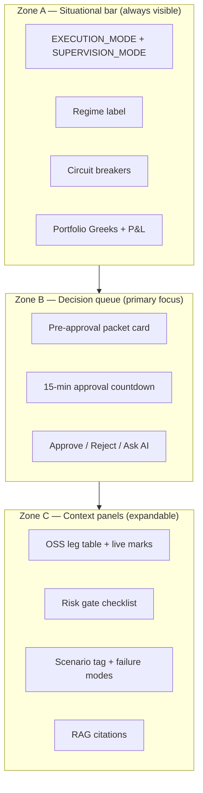

# UI Dashboard Specification

> **Sources:** `architecture.md` §5.2, §6.2.2, §8.5, §8.8, §13.2, §17.0, §20.4.7; `Trading_Strategies.md` (Supervised Execution Runbook, Pre-Approval Packet, Table SH-4); `Market_News.txt`; `Docs/Paper_Simulator.md`  
> **Status:** v1.1 — Phase 3 supervised cockpit; paper UI on **Vercel** → Railway API  
> **Implementation:** `frontend/src/components/dashboard/`

---

## Purpose

This document defines how the frontend should look and behave for **calculated, supervised trade decisions**. The UI is a **thin decision client**: it renders backend truth, captures operator intent, and calls APIs. It does not perform quantitative calculations, hold broker credentials, or call broker APIs directly.

The operating model:

- **Operator approves discretionary entries** before broker submit (`SUPERVISION_MODE=supervised`, Phase 2 default on paper — `architecture.md` §21).
- **Mechanical hedges** (delta drift, stops, circuit breakers) run automatically and appear in a separate activity stream — not in the approval queue.
- **Phase 1+ multi-leg opening completion:** after an entry is accepted, remaining intended opening legs may auto-fill without a second Approve — same capital / freshness / lot rules as the entry (`Paper_Simulator.md`).
- **One discretionary trade at a time** — the UI locks when a trade is pending or open.
- **Market condition** includes **Market_News**-driven sentiment (Architecture §8.8) crossed with playbook SH-4 — same logic used by paper-sim.

---

## Design Principle

The UI should feel like an **air-traffic control panel for calculated trades**, not a generic charting terminal. The operator applies judgment on top of calculated signals — especially economics for pairs and scenario fit — without re-deriving the trade in the browser.

---

## Layout: Three Zones



| Zone | Question answered |
|------|-------------------|
| **A — Situational bar** | Is it safe to trade at all right now? |
| **B — Decision queue** | Should I instruct the bot to take this specific trade? |
| **C — Context panels** | Why does the bot think this, and what could break it? |

---

## Zone B: Pre-Approval Packet (Core UI)

Maps to `Trading_Strategies.md` Pre-Approval Packet. Hero card for every pending decision on WebSocket channel `decisions.pending`.

| Section | Content | Why |
|---------|---------|-----|
| **Strategy header** | Strategy family badge, entry mode, confidence, regime fit | Strategy selection guide (Table SH-4) |
| **Market condition** | IV vs GARCH, residual z-score, intraday IV z-score, half-life, **Market_News tone/topics** | Confirms regime match + §8.8 news overlay |
| **Instruments** | Underlying(s), strikes, expiries, pair Y/X | Trade identity |
| **Entry rationale** | Quant signal + LLM explanation + RAG citations | Calculated-decision transparency |
| **Structure** | OSS multi-leg table: legs, per-leg Greeks, portfolio totals | Architecture §8.5, §9.3 |
| **Economics** | Net edge after costs, margin, slippage cap | Cost-awareness rule |
| **Plan** | Stop, target, time exit | Strategy-specific exits |
| **Event risks** | Earnings, borrow, stale feeds, term-structure flags, **news kill flags** | Shared pre-trade checklist + `Market_News.txt` |
| **Failure modes** | Scenario engine bullets | Conservative review |

### Card actions

| Action | API |
|--------|-----|
| **Approve** | `POST /api/v1/decisions/{id}/approve` |
| **Reject** | `POST /api/v1/decisions/{id}/reject` |
| **Ask AI** | RAG chat pre-loaded with decision context |

Show countdown for `approval_timeout_min` (default 15 min). Expired decisions do not auto-submit.

Phase 3: no in-browser leg editing. Reject and let the bot re-solve if structure is wrong.

---

## Strategy-Specific Panels

Card body adapts by strategy family:

### Statistical arbitrage

- Residual z-score bands (±2σ entry, ±3σ stop)
- Multi-window cointegration heatmap (20–250 days)
- Hedge ratio: slope, rounded shares, rounding error
- Economics gate (Table SA-8): macro alignment yes/no
- Half-life vs projected time in trade

### Simple volatility

- IV vs GARCH forecast (annualized)
- Greek targets: Δ≈0, Γ+, V+, Θ−
- Gamma-theta breakeven from last hedge point
- D+0 / D+1 horizon badge

### Gamma scalping

- Entry mode: `cheap_vol_mode` | `earnings_gap_mode` | `high_realized_vol_mode`
- Term structure state; reject flag if distorted
- Vega-neutral check at entry
- Expected re-hedge count and cost

### Vega scalping

- Intraday IV z-score vs mean (−2σ entry only)
- **Must flatten today** banner
- Stop at 3σ–4σ below mean

Show **why this strategy was chosen** over alternatives (Table SH-4 cross-strategy matrix), including the **Market_News** overlay that gated or preferred the row.

---

## Zone C: Risk Gate Checklist

Render backend pre-trade gate (`architecture.md` §11.4) as pass/fail rows:

```
✓ Feeds fresh          ✓ Confidence ≥ 0.70 (discretionary risk gate)
✓ RAG faithfulness     ✓ One-trade scope
✓ Net edge > 0         ✓ Margin sufficient
✗ Regime: high_vol_stress  → Approve disabled
```

**Recommendations screen:** only instruments with post-learning confidence ≥ **0.80** (`min_recommendation_confidence`) are ranked/shown (`architecture.md` §6.4). The scan set (G11–G12) is **all NSE F&O underlyings** from ICICI Direct’s instrument master — `universe_scanned` reflects that full list, not a fixed shortlist.

- **Green** — passed
- **Red** — hard block (Approve disabled)
- **Amber** — warning (e.g. RAG dissent logged)

Surface **Shared Kill Conditions** from `Trading_Strategies.md` as collapsible “abort if…” list.

---

## Supporting Views

| View | Route | Role |
|------|-------|------|
| Bot overview | `/dashboard` | Mode, scheduler, drawdown, pending count |
| **Recommendations** | `/recommendations` | Top-3 ranked trades with **complete insight packets** (P1 + score + gates + logic + learning overlay); only instruments with post-learning confidence ≥ **80%**; ranked fallback when fully autonomous |
| **Learning** | `/learning` | Continual learning loop: close trades, failure memory, module attribution, adaptation history (§12) |
| Decision queue | `/decisions` | Primary approval workflow |
| Decision detail | `/decisions/[id]` | Full packet + gate checklist |
| Positions | `/positions` | Open trades, mechanical hedge log |
| Risk | `/risk` | Live paper-sim circuit breakers, Greek limits, risk events (`GET /api/v1/risk/snapshot`) |
| Strategy simulator | `/strategies/simulator` | OSS config, feed binding (pre-market) |
| **Paper simulator** | `/paper-sim` | In-house paper path (`Paper_Simulator.md`): account, signals, **news**, automation status, fills — ICICI Direct marks only |
| AI chat | `/chat` | RAG deep dive during review |
| Supervision settings | `/settings/supervision` | Mode promotion checklist |

---

## Interaction by Supervision Mode

| Mode | UI behavior |
|------|-------------|
| **`supervised`** (Phase 3) | Approval queue is primary; alert on `decisions.pending` |
| **`semi_autonomous`** | High-confidence auto-submit; async review + override |
| **`fully_autonomous`** | Monitor-only; queue becomes audit history |

---

## Wireframe: Approval Card

```
┌─────────────────────────────────────────────────────────────┐
│ 🟡 PENDING · Gamma Scalping · earnings_gap_mode · 12:04 left │
├─────────────────────────────────────────────────────────────┤
│ INTC · Confidence 0.82 · Regime: event_vol                  │
│ Rationale: IV < GARCH; gap risk; vega neutral at entry      │
├─────────────────────────────────────────────────────────────┤
│ Legs (OSS)          Δ 0.02  Γ +1.4  V −0.1  Θ −420         │
│ [leg table with live marks from bound feeds]                │
├─────────────────────────────────────────────────────────────┤
│ Edge after costs: +$18.40 │ Margin: $4,200 │ Stop: gap rule │
│ Exit: close after gap │ Risks: earnings tonight             │
├─────────────────────────────────────────────────────────────┤
│ Gates: 11/12 pass │ RAG: Gamma Scalping Ch.5 p.132          │
├─────────────────────────────────────────────────────────────┤
│     [ Reject ]              [ Ask AI ]        [ Approve ✓ ] │
└─────────────────────────────────────────────────────────────┘
```

---

## Frontend Constraints (Must Not)

- Hold broker API keys or credentials
- Perform BSM, GARCH, cointegration, or hedge math
- Call broker APIs directly
- Override LLM reject on discretionary entries
- Manual multi-leg legging in production

---

## API & WebSocket Dependencies

| Channel / endpoint | Use |
|--------------------|-----|
| `GET /api/v1/decisions/pending` | Approval queue |
| `POST /api/v1/decisions/{id}/approve` | Approve |
| `POST /api/v1/decisions/{id}/reject` | Reject |
| `GET /api/v1/bot/supervision` | Supervision mode |
| `GET /api/v1/paper-sim/account` | Paper cash / equity / P&L |
| `GET /api/v1/paper-sim/news` | Market_News summary for paper path |
| `GET /api/v1/paper-sim/signals` | GARCH / IV z + SH-4 + news recommendation |
| `GET /api/v1/paper-sim/automation/status` | γ–θ re-hedge loop state |
| WebSocket `decisions.pending` | Real-time queue updates |
| WebSocket trade events | Positions monitor |

---

## Built Versions

| Version | Path | Description | Status |
|---------|------|-------------|--------|
| **v1.0** | `frontend/` | Supervised cockpit: Zone A bar, approval card, strategy panels, gate checklist, mock data for local dev | Implemented |
| **v1.1** | Planned | Live API + WebSocket wiring when backend Phase 3 ships | Not started |
| **v2.0** | Planned | Semi-autonomous async review lane, compact mobile layout | Not started |

### v1.0 component map

```
frontend/src/
├── app/
│   ├── dashboard/page.tsx      # Zone A overview + queue summary
│   ├── decisions/page.tsx      # Approval queue (Zone B)
│   ├── decisions/[id]/page.tsx # Full pre-approval packet
│   ├── positions/page.tsx
│   └── risk/page.tsx
├── components/dashboard/
│   ├── situational-bar.tsx     # Zone A
│   ├── approval-card.tsx       # Zone B hero
│   ├── risk-gate-checklist.tsx # Zone C
│   ├── oss-leg-table.tsx
│   ├── kill-conditions.tsx
│   └── strategy-panels/        # Per-family detail
├── lib/mock-data.ts            # Demo payloads matching §9.3 / §10.5 schemas
└── types/decisions.ts
```

Run locally:

```bash
cd frontend
npm install
npm run dev
```

Set `NEXT_PUBLIC_API_URL` (and `NEXT_PUBLIC_WS_URL` if used) when the backend is available.

**Hosted paper trading:** frontend deploys to **Vercel**; backend to **Railway**. Point Vercel `NEXT_PUBLIC_API_URL` at the Railway HTTPS URL and set Railway `CORS_ORIGINS` to the Vercel app URL(s). See `Docs/Paper_Simulator.md` (Hosted paper trading) and Architecture §17.0.

Until the backend is wired, pages use mock data via `USE_MOCK_DATA=true` (default in `.env.example`).

---

## Document Status

Update this file when:

- New dashboard views are added
- Supervision mode UX changes
- Pre-approval packet fields change in backend schemas
- Strategy families or gate checks are added
- Paper hosting URLs / Vercel ↔ Railway wiring changes (`NEXT_PUBLIC_API_URL`, CORS)
