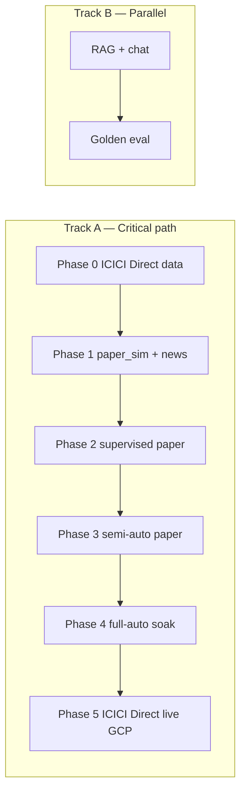

# Implementation Plan — Volatility Trading Bot

> **Authority:** `Docs/architecture.md` (v1.26+) §8.8–8.9, §11, §21  
> **Created:** July 16, 2026  
> **Scope:** Paper-first build → ICICI Direct live; **no MCP registry**

---

## 1. Integration decisions (locked)

| Concern | Implementation | Non-goal |
| ------- | -------------- | -------- |
| Market data (LTP, quotes, option chain, historical) | **ICICI Direct Breeze API** — `backend/integrations/icici_direct/market_data.py` + instrument master | Assignable MCP feed catalog |
| Live order placement / cancel / positions | **ICICI Direct** — `IciciDirectBrokerAdapter` when `EXECUTION_MODE=live` | MCP broker tools / `user-broker-feed` |
| Paper P&L | In-house **`paper_sim`** (ICICI Direct marks + local ledger) | ICICI Direct “paper/sandbox” API (does not exist) |
| India market news / sentiment | **`Market_News.txt` pipeline** — `backend/services/market_news/` (§8.8) | Dropping news; MCP `user-market-news` |
| Feed health in UI / recommendations | ICICI Direct session/WS freshness + news-service freshness → `feed_sources` | `mcp_sources` / MCP assignment status |

**Retire / replace in code (early Phase 0):**

- Remove or replace `backend/services/mcp_registry.py` with ICICI Direct feed-health helpers + `market_news` status.
- Rename API/UI fields: `mcp_sources` → `feed_sources`; drop `GET /feeds/mcp` (or replace with `/feeds/status`).
- Update `FeedStatusPanel` copy (no “MCP feed sources”).
- Keep `mock_market_news()` / live ingest under market-news service — sentiment dependency **stays**.

---

## 2. Tracks

Track B must not block Phase 0–1. Complete RAG faithfulness before LLM-gated discretionary entries (Phase 2+).

---

## 3. Phase 0 — Scaffold & ICICI Direct data-only (Weeks 1–2)

**Goal:** Deployable API + ICICI Direct marks; zero `place_order`.

| # | Work item | Done when |
| - | --------- | --------- |
| 0.1 | Native local toolchain (`Docs/LOCAL_DEV.md`; Python + Node; optional native PG/Redis; remote Nixpacks/Buildpacks) | `scripts/dev/check-env.ps1` + `/health` with `local_containers_required: false` |
| 0.2 | FastAPI scaffold, `GET /health`, `.env.example` | Health green locally |
| 0.3 | **Remove MCP registry** (see §1); expose ICICI Direct + news feed status | No `mcp_registry` / MCP routes |
| 0.4 | ICICI Direct **A0:** session manager + connection test API | `POST .../broker/test` succeeds with secrets |
| 0.5 | ICICI Direct **A1:** instrument master + LTP REST → normalized ticks | Marks refresh on demand |
| 0.6 | `GET /api/v1/paper-sim/health` stub; `EXECUTION_MODE=shadow` default | Mode documented |
| 0.7 | Railway (`backend/`) + Vercel (`frontend/`) wire-up | Frontend hits Railway API |
| 0.8 | Frontend shell: bot status, health, kill-switch placeholder | Per `UI_Dashboard.md` |

**Exit:** ICICI Direct marks on Railway; no Breeze API `place_order`; news path stubbed but schema present.

---

## 4. Phase 1 — Paper simulator + Market_News (Weeks 3–5)

**Goal:** End-to-end paper P&L with playbook + news gates. Authoritative API: `Docs/Paper_Simulator.md`.

| # | Work item | Done when |
| - | --------- | --------- |
| 1.1 | `paper_sim` ledger: account, positions, fills, multi-leg orders, close | Local P&L updates |
| 1.2 | Marks from ICICI Direct LTP + scrip master option chain | Fresh marks gate works |
| 1.3 | **`Market_News` ingest** (§8.8) → `GET /paper-sim/news` + recommendation `market_news` | Tone/topics/flags on packet |
| 1.4 | SH-4 strategy selection with news overlay (`Trading_Strategies.md`) | Kill / prefer rows honor news |
| 1.5 | GARCH / IV z-score + `POST /signals/evaluate` | Signals drive packet |
| 1.6 | γ–θ re-hedge automation | Mechanical hedges without LLM |
| 1.7 | BSM + OSS parity smoke; cost model; pre-trade thresholds | Tests green |
| 1.8 | Optional ICICI Direct **A2** WS Streaming 2.0 | Sub-second freshness |
| 1.9 | Optional ICICI Direct **A3** shadow dry-run order payloads | Logged only |
| 1.10 | `EXECUTION_MODE=paper` on Railway — never `live` | Confirmed in config |

**Exit:** Manual + automated paper trades; news gates honored; zero `place_order`.

---

## 5. Phase 2 — Supervised paper bot (Weeks 6–9)

| # | Work item |
| - | --------- |
| 2.1 | Bot scheduler; shadow week then paper single-module |
| 2.2 | `SUPERVISION_MODE=supervised` + Approve / Reject APIs |
| 2.3 | Supervised cockpit (decision queue — `UI_Dashboard.md`) |
| 2.4 | One-trade gate, circuit breakers, auto-pause, kill-switch |
| 2.5 | AI validator only after Track B golden eval green |
| 2.6 | Multi-leg paper order builder; ICICI Direct sequential multi-leg dry-run only |

**Exit:** Operator approves paper entries; mechanical hedges auto.

---

## 6. Phase 3 — Semi-autonomy on paper (Weeks 10–12)

| # | Work item |
| - | --------- |
| 3.1 | Promote to `semi_autonomous` after checklist |
| 3.2 | High-confidence auto-submit + residual queue |
| 3.3 | Learning engine, walk-forward, config rollback |
| 3.4 | Chaos: stale ICICI Direct feed, Groq down, Redis loss |

**Exit:** Semi-auto paper metrics in band; demotion path proven.

---

## 7. Phase 4 — Full autonomy paper soak (Weeks 13–16)

| # | Work item |
| - | --------- |
| 4.1 | `fully_autonomous` + ranked fallback #1→#2→#3 on **paper-sim only** |
| 4.2 | 2–4 week soak vs success criteria |
| 4.3 | Live readiness doc; `PROCESS_ROLE` ready for GCP — still no live submit |

**Exit:** Soak passes; operator signs Phase 5 gate.

---

## 8. Phase 5 — Live ICICI Direct on GCP (post–paper evidence)

Maps to ICICI Direct **A4–A6**. Region: **`asia-south1`**. Inventory: `infra/cloud-inventory.yaml`.

| # | Work item |
| - | --------- |
| 5.1 | GCP: Cloud Run API + worker, Cloud SQL, Memorystore, Filestore, Cloud NAT **static egress** |
| 5.2 | Secrets → Secret Manager; register static IP in Breeze API portal |
| 5.3 | **A4–A5:** live `place_order` / cancel / status; multi-leg + rollback; rate limits |
| 5.4 | Often re-start `supervised` on live, then re-promote |
| 5.5 | Micro-size + live gates (`architecture.md` §20.4.10) |
| 5.6 | **A6:** drop stub NSE quote paths; ICICI Direct sole live marks **and** orders |
| 5.7 | Uptime monitor on `/health/bot`; market-hours deploy pause |

**Exit:** Micro-size live with ICICI Direct marks + orders; Market_News still gating SH-4.

---

## 9. Track B — RAG / chat (parallel)

| Step | Deliverable | Timing |
| ---- | ----------- | ------ |
| B1 | One PDF → Chroma → `POST /chat` + UI + golden eval CI | With Phase 0–1 |
| B2 | Remaining PDFs; faithfulness ≥ 0.85 | Before LLM-gated trading |
| B3 | Ask AI from decision cards | Phase 2 cockpit |

---

## 10. Definition of done (integration slice)

- [ ] No MCP registry, MCP feed routes, or MCP-labeled UI for market data / orders / news assignment
- [ ] ICICI Direct supplies all live marks used by paper-sim and (later) live trading
- [ ] ICICI Direct `place_order` only under `EXECUTION_MODE=live` on GCP
- [ ] `Market_News.txt` pipeline produces `MarketNewsSummary` used by recommendations and paper-sim
- [ ] Recommendation / paper packets include ICICI Direct feed health + `market_news` (not MCP ids)

---

## 11. Doc sync checklist

When this plan changes, keep aligned:

| Document | What to update |
| -------- | -------------- |
| `Docs/architecture.md` | §8.8–8.9, §11.2, §11.15, §20.3, §21 |
| `Docs/context.md` | Integrations summary (§1, §5.7, §11.3) |
| `Docs/Paper_Simulator.md` | Marks = ICICI Direct; news = Market_News |
| `Docs/UI_Dashboard.md` | Feed status panel wording |
| `Docs/ICICI_Direct_Architecture.md` | Remains redirect stub only |
| `Docs/eval.md` | Phase exit gates, promotion scorecard, edge-case maps vs this plan |
| `Docs/edge_cases.md` | Phase-specific P0 lists (§19) when phase exits change |

---

*Build sequence detail and exit criteria mirror `architecture.md` §21. This plan adds the explicit **no-MCP / ICICI Direct + Market_News** workstream.*
