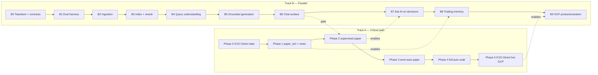

# Implementation Plan — Volatility Trading Bot

> **Authority:** `Docs/architecture.md` (v1.26+) §8.8–8.9, §11, §21  
> **Created:** July 16, 2026  
> **Scope:** Paper-first build → ICICI Direct live; **no MCP registry**

---

## 1. Integration decisions (locked)

| Concern                                             | Implementation                                                                                       | Non-goal                                          |
| --------------------------------------------------- | ---------------------------------------------------------------------------------------------------- | ------------------------------------------------- |
| Market data (LTP, quotes, option chain, historical) | **ICICI Direct Breeze API** — `backend/integrations/icici_direct/market_data.py` + instrument master | Assignable MCP feed catalog                       |
| Live order placement / cancel / positions           | **ICICI Direct** — `IciciDirectBrokerAdapter` when `EXECUTION_MODE=live`                             | MCP broker tools / `user-broker-feed`             |
| Paper P&L                                           | In-house `paper_sim` (ICICI Direct marks + local ledger)                                             | ICICI Direct “paper/sandbox” API (does not exist) |
| India market news / sentiment                       | `Market_News.txt` **pipeline** — `backend/services/market_news/` (§8.8)                              | Dropping news; MCP `user-market-news`             |
| Feed health in UI / recommendations                 | ICICI Direct session/WS freshness + news-service freshness → `feed_sources`                          | `mcp_sources` / MCP assignment status             |

**Locked product decision (2026-08-01):** options-only hard lock. The bot constructs, recommends, paper-trades, and live-submits Call/Put option legs only. There is no stock/underlying trading path, no T11 spot cap, and no index exclusion when ATM / premium / liquidity / risk gates pass.

**Retire / replace in code (early Phase 0):**

- Remove or replace `backend/services/mcp_registry.py` with ICICI Direct feed-health helpers + `market_news` status.
- Rename API/UI fields: `mcp_sources` → `feed_sources`; drop `GET /feeds/mcp` (or replace with `/feeds/status`).
- Update `FeedStatusPanel` copy (no “MCP feed sources”).
- Keep `mock_market_news()` / live ingest under market-news service — sentiment dependency **stays**.

---

## 2. Tracks

Track B **must not block** Phase 0–1. **B0–B6 must all pass before Phase 2** LLM-gated discretionary entries. B7 needs the Phase 2 cockpit, B8 needs closed paper trades from Phase 1, B9 lands with Phase 5.

---

## 3. Phase 0 — Scaffold & ICICI Direct data-only (Weeks 1–2)

**Goal:** Deployable API + ICICI Direct marks; zero `place_order`.

| #   | Work item                                                                                                         | Done when                                                                       |
| --- | ----------------------------------------------------------------------------------------------------------------- | ------------------------------------------------------------------------------- |
| 0.1 | Native local toolchain (`Docs/LOCAL_DEV.md`; Python + Node; optional native PG/Redis; remote Nixpacks/Buildpacks) | `scripts/dev/check-env.ps1` + `/health` with `local_containers_required: false` |
| 0.2 | FastAPI scaffold, `GET /health`, `.env.example`                                                                   | Health green locally                                                            |
| 0.3 | **Remove MCP registry** (see §1); expose ICICI Direct + news feed status                                          | No `mcp_registry` / MCP routes                                                  |
| 0.4 | ICICI Direct **A0:** session manager + connection test API                                                        | `POST .../broker/test` succeeds with secrets                                    |
| 0.5 | ICICI Direct **A1:** instrument master + LTP REST → normalized ticks; **G11–G12 universe = all NSE F&O underlyings** from `FONSEScripMaster.txt` | Marks refresh on demand; recommendations scan full FNO list |
| 0.6 | `GET /api/v1/paper-sim/health` stub; `EXECUTION_MODE=shadow` default                                              | Mode documented                                                                 |
| 0.7 | Railway (`backend/`) + Vercel (`frontend/`) wire-up                                                               | Frontend hits Railway API                                                       |
| 0.8 | Frontend shell: bot status, health, kill-switch placeholder                                                       | Per `UI_Dashboard.md`                                                           |

**Exit:** ICICI Direct marks on Railway; no Breeze API `place_order`; news path stubbed but schema present.

---

## 4. Phase 1 — Paper simulator + Market_News (Weeks 3–5)

**Goal:** End-to-end paper P&L with playbook + news gates. Authoritative API: `Docs/Paper_Simulator.md`.

| #    | Work item                                                                              | Done when                     |
| ---- | -------------------------------------------------------------------------------------- | ----------------------------- |
| 1.1  | `paper_sim` ledger: account, positions, fills, multi-leg orders, close                 | Local P&L updates             |
| 1.1a | Post-entry multi-leg auto-complete without consent (same open-trade rules)             | Incomplete → complete under ₹1L / freshness / lot gates |
| 1.2  | Marks from ICICI Direct LTP + scrip master option chain                                | Fresh marks gate works        |
| 1.3  | `Market_News` **ingest** (§8.8) → `GET /paper-sim/news` + recommendation `market_news` | Tone/topics/flags on packet   |
| 1.4  | SH-4 strategy selection with news overlay (`Trading_Strategies.md`)                    | Kill / prefer rows honor news |
| 1.5  | GARCH / IV z-score + `POST /signals/evaluate`                                          | Signals drive packet          |
| 1.6  | γ–θ re-hedge automation                                                                | Mechanical hedges without LLM |
| 1.7  | BSM + OSS parity smoke; cost model; pre-trade thresholds                               | Tests green                   |
| 1.8  | ICICI Direct **A2** WS Streaming 2.0 (mandatory)                                       | Sub-second freshness          |
| 1.9  | ICICI Direct **A3** shadow dry-run order payloads (mandatory unless a replacement broker adapter is coded) | Logged only; no live submit |
| 1.10 | `EXECUTION_MODE=paper` on Railway — never `live`                                       | Confirmed in config           |

**Exit:** Manual + automated paper trades; news gates honored; A2 WS marks at sub-second freshness; A3 shadow dry-run payloads logged (or equivalent on a coded replacement broker); zero live `place_order`.

---

## 5. Phase 2 — Supervised paper bot (Weeks 6–9)

| #   | Work item                                                                     |
| --- | ----------------------------------------------------------------------------- |
| 2.1 | Bot scheduler; shadow week then paper single-module                           |
| 2.2 | `SUPERVISION_MODE=supervised` + Approve / Reject APIs                         |
| 2.3 | Supervised cockpit (decision queue — `UI_Dashboard.md`)                       |
| 2.4 | One-trade gate, circuit breakers, auto-pause, kill-switch                     |
| 2.5 | AI validator only after Track B golden eval green                             |
| 2.6 | Live-path multi-leg builder polish; ICICI Direct sequential multi-leg dry-run only (paper auto-complete already Phase 1) |

**Exit:** Operator approves paper entries; mechanical hedges + opening multi-leg completion auto.

---

## 6. Phase 3 — Semi-autonomy on paper (Weeks 10–12)

| #   | Work item                                             |
| --- | ----------------------------------------------------- |
| 3.1 | Promote to `semi_autonomous` after checklist          |
| 3.2 | High-confidence auto-submit + residual queue          |
| 3.3 | Learning engine, walk-forward, config rollback        |
| 3.4 | Chaos: stale ICICI Direct feed, Groq down, Redis loss |

**Exit:** Semi-auto paper metrics in band; demotion path proven.

---

## 7. Phase 4 — Full autonomy paper soak (Weeks 13–16)

| #   | Work item                                                               |
| --- | ----------------------------------------------------------------------- |
| 4.1 | `fully_autonomous` + ranked fallback #1→#2→#3 on **paper-sim only**     |
| 4.2 | 2–4 week soak vs success criteria                                       |
| 4.3 | Live readiness doc; `PROCESS_ROLE` ready for GCP — still no live submit |

**Exit:** Soak passes; operator signs Phase 5 gate.

---

## 8. Phase 5 — Live ICICI Direct on GCP (post–paper evidence)

Maps to ICICI Direct **A4–A6**. Region: `asia-south1`. Inventory: `infra/cloud-inventory.yaml`.

| #   | Work item                                                                                   |
| --- | ------------------------------------------------------------------------------------------- |
| 5.1 | GCP: Cloud Run API + worker, Cloud SQL, Memorystore, Filestore, Cloud NAT **static egress** |
| 5.2 | Secrets → Secret Manager; register static IP in Breeze API portal                           |
| 5.3 | **A4–A5:** live `place_order` / cancel / status; multi-leg + rollback; rate limits          |
| 5.4 | Often re-start `supervised` on live, then re-promote                                        |
| 5.5 | Micro-size + live gates (`architecture.md` §20.4.10)                                        |
| 5.6 | **A6:** drop stub NSE quote paths; ICICI Direct sole live marks **and** orders              |
| 5.7 | Uptime monitor on `/health/bot`; market-hours deploy pause                                  |

**Exit:** Micro-size live with ICICI Direct marks + orders; Market_News still gating SH-4.

---

## 9. Track B — Knowledge layer / RAG / chat (parallel)

> **Status:** the original B1/B2/B3 steps are **retired**. The first Track B1 implementation is being un-implemented (§9.2) and rebuilt across ten phases **B0–B9**. Authority remains `Docs/architecture.md` §7; exit gates remain `Docs/eval.md` §8 (EB-A…EB-F).

### 9.0 Why the first implementation is being replaced

Retrieval in the first build was structurally sound — hybrid dense + BM25 with reciprocal rank fusion, a rich trading metadata taxonomy, chunk deprecation on re-ingest. Answer quality failed for five specific reasons, each of which needs a **structural** fix rather than tuning. The phase that closes each one is named in the last column.

| # | Root cause in the first build                                                                                                                                                                 | Structural fix                                                                                                                                     | Phase |
| - | ----------------------------------------------------------------------------------------------------------------------------------------------------------------------------------------------- | ---------------------------------------------------------------------------------------------------------------------------------------------------- | ----- |
| 1 | **Embeddings of unverifiable provenance.** `EMBEDDING_BACKEND` fell back to a semantics-free SHA-256 `HashEmbeddingFunction` on any exception via bare `except: pass`. Hash and MiniLM are both 384-d, so Chroma raised no dimension error. Dense retrieval may have been pure noise. | Fail-closed embedding provider. Model, version, dimension and corpus checksum stamped into collection metadata; startup asserts index matches config and **refuses to serve** on mismatch. No fallback provider exists in the code. | B3    |
| 2 | **Partial extraction.** 83 chunks from a ~1.9 MB book, and 3 of 4 PDFs never ingested. No check would have caught it.                                                                          | Extraction coverage gate — pages extracted vs. page count, chars-per-page distribution, empty-page report. Ingest **fails** below threshold.        | B2    |
| 3 | **Fixed 2,200-char slicing** with a hardcoded per-PDF chapter table, cutting through equations and merging unrelated sections — the exact anti-pattern `architecture.md` §7 Stage 5 forbids.  | Structural parse into a chapter/section tree from each PDF's own outline, then token-budgeted semantic chunking on definition / derivation / example / procedure boundaries, with equations and table rows atomic. | B2    |
| 4 | **No re-ranker.** `architecture.md` §7 Stage 10 specifies a cross-encoder over the top 50; the code substituted `+0.01 × token-overlap`, a tiebreaker, not relevance modelling.                | Vertex AI Ranking API cross-encoder over the fused top-50 → top-8.                                                                                 | B3    |
| 5 | **`faithfulness_ok` was fabricated** — hardcoded `True` whenever any chunk was retrieved. The CI gate was circular: with `GROQ_API_KEY=""` the "answer" was the retrieved chunks concatenated, then scored for token overlap against those same chunks, so it could not fail. The ≥ 0.85 gate measured nothing. | Inline `[S1]` source markers, claim-level verification against the cited `chunk_id`, and an **independent judge model**. `faithfulness_ok` becomes computed and can be `False`. Anti-circularity tests prove the harness can fail. | B1, B5 |

Two further defects removed outright: the **extractive fallback** that concatenated chunk excerpts and presented them as an answer (deleted — an unavailable LLM now returns an explicit degraded state, never fabricated prose), and **per-worker in-process BM25** rebuilt from a full collection scan at boot (replaced by an artifact the ingest job builds and the server loads read-only).

### 9.1 Locked decisions and global constraints

Every phase below inherits these. They were settled before planning and are not revisited mid-track.

| Decision                | Value                                                                                                                                                                                | Rationale                                                                                                                       |
| ----------------------- | -------------------------------------------------------------------------------------------------------------------------------------------------------------------------------------- | --------------------------------------------------------------------------------------------------------------------------------- |
| Teardown depth          | **Total.** Backend RAG, chat service, chat + knowledge routers, chat schemas, the `backend/quality` package, the frontend `/chat` surface, Chroma data, and all Track-B tests are deleted before rebuilding. | A partial rewrite would preserve the silent-fallback and fake-faithfulness patterns.                                            |
| Embeddings              | **Vertex AI `gemini-embedding-001`**, `output_dimensionality=3072` (pre-normalized at 3072; other sizes require manual normalization), 2048-token input cap, `task_type=RETRIEVAL_DOCUMENT` for chunks with `title=heading_path`, `RETRIEVAL_QUERY` for queries. | Managed, no model files in the image, strong on technical English. Supersedes the `bge-m3` pin in `architecture.md` §7 Stage 7. |
| Re-ranker               | **Vertex AI Ranking API**, `semantic-ranker-default@latest` on `discoveryengine.googleapis.com`, `rankingConfigs.rank`, location `global`.                                            | Managed cross-encoder. Supersedes the `bge-reranker-large` pin in §7 Stage 10.                                                  |
| **Rerank hard limits**  | **≤ 512 tokens per record** (title + content combined; silently truncated beyond) and **≤ 200 records per request**.                                                                 | Drives the parent/child chunking design below. Verified against vendor docs.                                                    |
| Chunking                | **Small-to-big.** Child chunks ≤ 450 tokens are embedded and re-ranked; the **parent section** they belong to is what reaches the LLM.                                               | 400–800-token chunks would be truncated by the re-ranker at 512, so it would score relevance on partial text. Small-to-big also resolves §7 Stage 5's context-richness vs. retrieval-precision tradeoff. |
| Vector store            | **ChromaDB** retained. Embedded `PersistentClient` locally and on Railway; Chroma on Cloud Run + Filestore NFS from B9.                                                              | Preserves the trading metadata taxonomy and filtered retrieval; keeps the knowledge layer portable. Per §7.2 Stage 8.           |
| **GCP boundary**        | Track B calls **Vertex AI APIs** from B0 using a service-account key — these are ordinary HTTPS calls and work from Windows and from Railway. **No GCP infrastructure** (Cloud Run, Cloud SQL, Memorystore, VPC, static egress IP) before Phase 5 / B9. | Keeps the §8 Phase 5 boundary intact while building the index once, against its final embedding model, with no re-baselining.   |
| Region                  | Vertex calls from `asia-south1` where regional; Ranking API is `global`.                                                                                                             | Per the project's GCP region rule.                                                                                              |
| **No silent fallbacks** | Anywhere a model, index, filter, or re-ranker call fails, the request **fails or is flagged degraded on the response**. No component may substitute a lower-quality path unannounced. | This single rule is what made defects 1, 4 and 5 invisible.                                                                     |
| CI without keys         | Vertex embedding, rerank, and judge responses are **recorded to fixtures and replayed** in CI. A cache miss is a **hard failure**, never a substituted backend.                       | CI's need to run keyless is what produced the hash-embedding disaster.                                                          |
| Generation model        | Groq `llama-3.3-70b-versatile`, temperature 0.1, behind a provider interface.                                                                                                        | Unchanged from `architecture.md` §10.1.                                                                                         |
| Judge model             | **Must differ from the generation model.** A generator cannot grade its own grounding.                                                                                               | Closes the circularity in defect 5.                                                                                             |
| Corpus                  | The four PDFs of §3.2: `Volatility Trading.pdf`, `Gamma Scalping.pdf`, `Vega Scalping.pdf`, `Trading_Strategies.pdf`.                                                                | Unchanged.                                                                                                                      |

**Where the deleted `backend/quality` package's responsibilities go.** It ran the full validator pipeline 3–4× per request and gated on a fabricated faithfulness flag. Relevance and completeness scoring move **offline** into the B1 evaluation harness where they belong; toxicity, bias, secret-refusal and prompt-injection defence become a **single-pass** guardrail in B5.7. Net effect: better measurement, one pass instead of four.

### 9.2 Phase B0 — Teardown and contracts (with Phase 0)

**Goal:** the first implementation is gone, the repo is green, and Vertex access is proven from the dev machine. No RAG code exists yet.

| #    | Work item                                                                                                                                                                                              | Done when                                                            |
| ---- | -------------------------------------------------------------------------------------------------------------------------------------------------------------------------------------------------------- | ------------------------------------------------------------------------ |
| B0.1 | Delete `backend/knowledge/**` in full — manifest, ingestion, vectorstore, retrieval, evaluation, `golden_qa.jsonl`                                                                                      | Directory absent                                                     |
| B0.2 | Delete `backend/services/chat_service.py`, `backend/models/chat.py`, `backend/routers/chat.py`, `backend/routers/knowledge.py`; unregister both routers in `backend/main.py`                            | App boots; `/api/v1/chat` and `/api/v1/knowledge/*` return 404       |
| B0.3 | Delete `backend/quality/**` and `backend/routers/quality.py`; unregister                                                                                                                               | No quality routes                                                    |
| B0.4 | Delete `backend/tests/knowledge/**` and `backend/tests/quality/**`                                                                                                                                     | `pytest backend/tests` green                                         |
| B0.5 | Frontend: delete `src/app/chat/`, `src/components/chat/`, `src/types/chat.ts`; remove `postChat` + `mockChatAnswer` from `src/lib/api.ts`; remove the `AI Chat` nav entry in `layout/app-shell.tsx`; remove the `Ask AI` deep link in `dashboard/approval-card.tsx` | `npm run build` clean; no dead imports                               |
| B0.6 | Purge Chroma data: `backend/data/chroma/**`                                                                                                                                                            | Directory empty                                                      |
| B0.7 | Remove now-dead env vars from `.env.example`, `backend/.env.example`, `scripts/dev/start-backend.ps1`, `scripts/dev/check-env.ps1`: `EMBEDDING_BACKEND`, `RAG_AUTO_INGEST`, `RAG_EVAL_OFFLINE`, `RAG_FAITHFULNESS_GATE`, `CHROMA_HOST`, `CHROMA_PORT` | `check-env.ps1` passes                                               |
| B0.8 | Repo-wide sweep for orphaned references to the removed surface (`mcp`-style leftovers: `faithfulness_ok`, `knowledge_base`, `ChatResponse`, `RAGService`)                                              | Grep returns only §9 of this plan and `architecture.md` §7           |
| B0.9 | GCP **API access only** — create project, enable `aiplatform.googleapis.com` and `discoveryengine.googleapis.com`, issue one service account with `Vertex AI User` + `Discovery Engine User`, key referenced by `GOOGLE_APPLICATION_CREDENTIALS`; document in `Docs/LOCAL_DEV.md`. **No Cloud Run, Cloud SQL, VPC, or static IP.** | Key present locally and in Railway env; §8 Phase 5 scope unchanged   |
| B0.10 | `scripts/knowledge/smoke_vertex.py` — one embedding call and one rank call, printing dimension and score                                                                                               | Returns a 3072-d vector and a rank score from Windows                |
| B0.11 | Write `Docs/RAG_Contract.md` freezing the request/response shape for `POST /api/v1/chat` (including `citations[]`, `faithfulness`, `degraded`) before any implementation                                | Doc committed; B6 implements against it                              |

**Exit:** no RAG, chat, or quality code in the repo; backend tests and frontend build green; `smoke_vertex.py` succeeds; §8 Phase 5 GCP scope untouched.

### 9.3 Phase B1 — Evaluation harness first (with Phase 0)

**Goal:** build the ruler before the thing it measures. Nothing in B2–B9 is provably better than the first implementation without this, and the first implementation's ruler was rigged to pass.

Ground truth is expressed as **document + page range + expected quote**, never as `chunk_id`s, so the golden set survives re-chunking. A resolver maps quotes to `chunk_id`s after each index build.

| #    | Work item                                                                                                                                                                                                    | Done when                                                                    |
| ---- | ---------------------------------------------------------------------------------------------------------------------------------------------------------------------------------------------------------------- | -------------------------------------------------------------------------------- |
| B1.1 | `backend/knowledge/evaluation/golden/golden_qa.yaml` — **≥ 60 questions** across all four PDFs (`architecture.md` §7 requires 50–100). Categories: definition, derivation, procedure, risk_note, **cross-document comparison (≥ 10)**, numeric, and **out-of-corpus refusal (≥ 8)**. Each row: `id`, `question`, `document_id`, `page_range`, `expected_quote`, `must_include_terms`, `must_not_include_terms`, `reference_answer`, `category`, `difficulty`, `expected_filters` | Committed and peer-read                                                      |
| B1.2 | `evaluation/resolve.py` — normalized-text search mapping each `expected_quote` to `chunk_id`s post-build. **An unresolvable quote fails the run**, which is what catches extraction gaps like defect 2       | Resolver reports 100% or names the missing quotes                            |
| B1.3 | `evaluation/retrieval_metrics.py` — recall@50 (candidate pool), recall@5, precision@5, MRR@10, citation accuracy, refusal precision/recall. **No LLM involved**, so this runs free and deterministically      | Unit-tested against a hand-built fixture index                               |
| B1.4 | `evaluation/faithfulness.py` — independent judge model; splits the answer into claims, checks each against the chunks its `[Sn]` marker cites, returns a score plus the list of unsupported claims            | Returns < 1.0 on a deliberately unsupported answer                           |
| B1.5 | `evaluation/answer_quality.py` — judge-scored relevance and completeness against `reference_answer` (absorbs the deleted quality package's offline role)                                                      | Scores correlate with manual read on 10 samples                              |
| B1.6 | `evaluation/fixtures.py` — record/replay for embedding, rerank, and judge calls. **Cache miss raises**; there is no substitute backend                                                                        | Suite runs offline from committed fixtures                                   |
| B1.7 | `evaluation/runner.py` CLI: `python -m backend.knowledge.evaluation.runner --suite golden [--record] [--baseline]`, writing `evaluation/baselines/<date>.json`                                                | Baseline file produced                                                       |
| B1.8 | **Anti-circularity tests** — the harness must FAIL on: (a) an answer that is the retrieved context pasted verbatim, (b) a confident answer to an out-of-corpus question, (c) citations pointing at chunks not retrieved, (d) a plausible answer with fabricated numbers | All four score below gate. *This is the test the first implementation's harness could not have passed.* |
| B1.9 | Merge-blocking CI job in `.github/workflows/backend-ci.yml`, **separate from the unit-test step**, comparing to the committed baseline and failing on regression beyond tolerance                             | Job red on a seeded regression                                               |

**Exit:** the harness runs against an **empty** index, reports 0.0 across the board without crashing, and all four anti-circularity tests fail the gate as designed. Baseline committed.

### 9.4 Phase B2 — Ingestion quality (with Phase 1)

**Goal:** produce verified chunk artifacts for all four PDFs. Chunk quality is gated **before** a single embedding call is paid for. Per `architecture.md` §7: *ingestion pipeline quality — not LLM choice — determines RAG effectiveness.*

| #    | Work item                                                                                                                                                                          | Done when                                                                |
| ---- | -------------------------------------------------------------------------------------------------------------------------------------------------------------------------------------- | ---------------------------------------------------------------------------- |
| B2.1 | `knowledge/manifest.py` — `DocumentSpec` per PDF with `document_id`, title, path, version, **sha256**, page count. No `active_for_b1` flag; all four are active                     | Checksum mismatch aborts ingest                                          |
| B2.2 | `corpus/extract.py` — PyMuPDF text with layout, **pdfplumber tables → markdown**, equation and Greek-symbol detection, figure captions. `has_table` becomes real, not hardcoded `False` | Tables recoverable from at least one known page per PDF                  |
| B2.3 | **Coverage gate** in `corpus/coverage.py` — pages extracted / total = 1.0, median chars-per-page within band, < 2% empty pages, per-document report. **Ingest fails below threshold** | A truncated PDF fails the gate in test                                   |
| B2.4 | `corpus/normalize.py` — strip repeated headers/footers and page numbers, rejoin hyphenation, **preserve LaTeX-like and Unicode math**, collapse whitespace, keep list indentation   | Greek symbols and equations survive round-trip                           |
| B2.5 | `corpus/structure.py` — build the Chapter → Section → Subsection tree from **each PDF's own outline**, falling back to font-size heading detection. **No hardcoded per-document page tables** | All four PDFs produce sane trees                                         |
| B2.6 | `chunking/parent_child.py` — parents are sections (split at ~1800 tokens); children ≤ **450 tokens** with 15% overlap; boundaries at definition / derivation / example / procedure; **equations and table rows atomic** | Zero children exceed 450 tokens; zero mid-equation splits                |
| B2.7 | `enrich/` — `taxonomy.py` controlled vocabularies per §7 Stage 6, `rules.py` deterministic heading/keyword tagging, `llm_tagger.py` **offline batch** classification for low-confidence chunks. Out-of-vocabulary tags are rejected | Tag coverage ≥ 95%; no free-text tags                                    |
| B2.8 | `chunking/report.py` — token distribution, % split mid-sentence (target 0), equation preservation rate, tag coverage, parent/child ratio                                            | Report committed per build                                               |
| B2.9 | Ingest emits **JSONL artifacts**, not an index — decoupling chunk quality from embedding spend                                                                                      | `artifacts/chunks/<doc>@<version>.jsonl` present for all four            |

**Exit:** all four PDFs at 100% page coverage; chunk count within an expected band and **plainly not the 83 of the first build**; every `expected_quote` in the golden set resolves to a chunk (B1.2 green); chunk quality report clean.

### 9.5 Phase B3 — Index, hybrid retrieval, re-ranking (with Phase 1)

**Goal:** measurably good retrieval, with the quality of the index provable at startup.

| #    | Work item                                                                                                                                                                                                      | Done when                                                                  |
| ---- | ------------------------------------------------------------------------------------------------------------------------------------------------------------------------------------------------------------------ | ------------------------------------------------------------------------------ |
| B3.1 | `index/embeddings.py` — Vertex `gemini-embedding-001` provider, batched, retry with backoff, `RETRIEVAL_DOCUMENT` + `title=heading_path` for chunks and `RETRIEVAL_QUERY` for queries. **Fail closed: no fallback provider, no bare except** | An induced auth error raises rather than degrading                         |
| B3.2 | `index/chroma_store.py` — collection **provenance metadata**: `embedding_model`, `embedding_version`, `dimension`, `corpus_checksum`, `built_at`. Startup assertion refuses to serve on mismatch                | Dimension-mismatch test proves the server won't start                      |
| B3.3 | **Atomic build** — write to `knowledge_base__<build_id>`, verify counts, then flip the alias. Deprecated chunks are **deleted**, not flagged, so the collection stops growing on re-ingest                      | Two consecutive builds leave one live collection                           |
| B3.4 | `index/sparse.py` — BM25 built by the ingest job and serialized to disk; the server **loads it read-only**. No per-worker rebuild, no empty-result window at boot                                               | Multi-worker start serves correct results immediately                      |
| B3.5 | `retrieval/hybrid.py` — dense top-50 + sparse top-50 → RRF (k = 60) → 50 candidates. Equal weighting; the first build's double-counted-sparse hack is not carried over                                          | Fusion unit-tested on synthetic rankings                                   |
| B3.6 | `retrieval/rerank.py` — Vertex Ranking API, `semantic-ranker-default@latest`, **≤ 200 records** per call, child text **verified ≤ 512 tokens before send**, `top_n=8`, timeout + retry. On failure, fall back to RRF order **and set `degraded.rerank=true` on the response** | Truncation assertion tested; degraded flag surfaces                        |
| B3.7 | `retrieval/expand.py` — dedupe re-ranked children by parent, fetch parents, assemble within a context token budget                                                                                              | No duplicate parents; budget never exceeded                                |
| B3.8 | Run the B1 harness; record the **retrieval baseline**, including an explicit A/B of re-ranked vs. RRF-only                                                                                                     | Baseline committed with both arms                                          |

**Exit:** recall@5 ≥ 0.85 and MRR@10 ≥ 0.75 on the golden set; re-ranking shows a measurable precision@5 gain over RRF-only in the recorded A/B; the dimension-mismatch refusal test passes.

### 9.6 Phase B4 — Query understanding (with Phase 1)

**Goal:** use the metadata taxonomy that the first build computed, stored, and then ignored.

| #    | Work item                                                                                                                                                                        | Done when                                                        |
| ---- | ------------------------------------------------------------------------------------------------------------------------------------------------------------------------------------ | -------------------------------------------------------------------- |
| B4.1 | `retrieval/query.py` — rewriting: decontextualize follow-ups against conversation history, expand domain shorthand (IV, HV, RV, θ, γ, ν, OU, z-score)                             | Rewrites logged and asserted on 15 cases                         |
| B4.2 | Intent classification → `definition \| derivation \| procedure \| risk \| comparison \| numeric \| out_of_scope`                                                                  | ≥ 90% on a labelled subset of the golden set                     |
| B4.3 | Intent → metadata filters (`strategy`, `concepts`, `content_type`, `difficulty`) applied as Chroma `where`. **A filter error fails the request** — the first build silently retried unfiltered, which could surface deprecated chunks | Induced filter error returns an error, not unfiltered results    |
| B4.4 | Multi-query fan-out for `comparison` intent — one sub-query per document, results fused before re-ranking                                                                        | Cross-document questions retrieve from ≥ 2 documents             |
| B4.5 | `out_of_scope` short-circuits to refusal **without retrieval**                                                                                                                   | No embedding call made on out-of-corpus questions                |
| B4.6 | Filter passthrough end to end in the API contract — the first build plumbed `filters.strategy` through the backend but the UI never sent it                                      | Contract test covers a UI-supplied filter                        |

**Exit:** metrics improve on the hard subset (comparison + shorthand questions) against the B3 baseline; refusal recall ≥ 0.95 on the out-of-corpus rows; **no regression** on the easy subset.

### 9.7 Phase B5 — Grounded generation with verified citations (with Phase 1)

**Goal:** answers that are checkably grounded. This phase closes EB-A, EB-B, EB-D and EB-F.

| #    | Work item                                                                                                                                                       | Done when                                                             |
| ---- | ------------------------------------------------------------------------------------------------------------------------------------------------------------------- | ------------------------------------------------------------------------- |
| B5.1 | `generation/prompts/{chat,decision,judge}.json` as **files, not inline Python strings** — satisfies EB-F and `architecture.md` §10.7                              | Profiles loaded from disk; isolation test in B5.8                     |
| B5.2 | `generation/builder.py` — context blocks per §7 Stage 11 with `[S1]…[Sn]` markers mapped to `chunk_id`s                                                          | Marker↔chunk map returned alongside the prompt                        |
| B5.3 | `generation/answer.py` — Groq call at temperature 0.1, **required** inline markers on every factual sentence                                                     | Marker-free output triggers one retry then refusal                    |
| B5.4 | `generation/verify.py` — parse markers, reject any pointing at a non-retrieved chunk, run sentence-level support checks, compute a **real** `faithfulness_ok`     | Returns `False` on a seeded hallucination                             |
| B5.5 | Refusal path — insufficient grounding returns an explicit "not covered in the knowledge base", naming what was searched                                          | Out-of-corpus questions refuse with a searched-scope note             |
| B5.6 | **No extractive fallback.** LLM unavailable → HTTP 503 with `degraded.generation=true`. Never chunk excerpts dressed as prose                                    | Groq outage test returns 503, not a fake answer                       |
| B5.7 | Single-pass guardrail — secret/API-key/credential refusal (EB-D), toxicity and bias checks, and **prompt-injection defence over retrieved content** (a PDF chunk must not be able to issue instructions) | EB-D suite passes; an injected instruction in a chunk is ignored      |
| B5.8 | Chat vs. decision profile isolation test — a chat request must not be able to reach the decision profile or its data                                             | Isolation test green (EB-F)                                           |

**Exit:** **faithfulness ≥ 0.85 measured by the independent judge** (EB-B); every citation maps to a retrieved `chunk_id` (EB-A); empty or unreachable Chroma degrades correctly and the discretionary RAG gate fails closed (EB-C); EB-D passes.

### 9.8 Phase B6 — Chat surface rebuild (with Phase 1; **gates Phase 2**)

**Goal:** the user-facing chatbot of `architecture.md` §7.7, rebuilt against the B0.11 contract.

| #    | Work item                                                                                                                                                                | Done when                                                          |
| ---- | ------------------------------------------------------------------------------------------------------------------------------------------------------------------------------ | ---------------------------------------------------------------------- |
| B6.1 | `POST /api/v1/chat` plus **`POST /api/v1/chat/stream` (SSE)**; `ttft_ms` measured at the genuine first token — the first build marked it at request start, making it meaningless | Streaming visible in the browser; TTFT tracks reality               |
| B6.2 | Conversation history persisted per session with an N-turn window, feeding B4.1 rewriting. The first build was stateless                                                   | A 10-turn conversational suite resolves pronouns correctly          |
| B6.3 | `backend/models/chat.py` per `Docs/RAG_Contract.md` — `citations[]`, `faithfulness`, `degraded`, `retrieval_debug`                                                        | Contract tests green                                                |
| B6.4 | **Async correctness** — Vertex, Chroma and Groq calls moved off the event loop. The first build made blocking calls inside `async def` handlers, including full re-ingest inline in a request | Load test shows no event-loop stalls                                |
| B6.5 | Frontend `/chat` rebuild: streaming render, citation chips linking to document + page, filter controls, explicit refusal and degraded states, retrieval-debug drawer behind a flag | Manual walkthrough of all four states                               |
| B6.6 | Rate limiting and a per-session token budget                                                                                                                             | Limit enforced under test                                           |
| B6.7 | Ingest becomes the CLI job `scripts/knowledge/ingest.py`; the HTTP route is **admin-authenticated and enqueue-only**. The first build's `/knowledge/ingest` was unauthenticated and unbounded | Unauthenticated ingest returns 401                                  |

**Exit:** all of EB-A…EB-D and EB-F pass; streaming and multi-turn work end to end. **This is the gate for Phase 2 LLM-gated discretionary entries** and for work item 2.5 (AI validator).

### 9.9 Phase B7 — Ask AI from decision cards (needs the Phase 2 cockpit)

**Goal:** make the deep link real. The first build accepted `decision_id` and discarded it, so the feature was cosmetic.

| #    | Work item                                                                                                        | Done when                                                    |
| ---- | -------------------------------------------------------------------------------------------------------------------- | ---------------------------------------------------------------- |
| B7.1 | Decision context loader — hydrate the full recommendation packet from `decision_id`                              | Packet fields available to the prompt                        |
| B7.2 | Decision prompt profile combining packet fields with retrieved playbook chunks                                   | Answers cite both sources distinctly                         |
| B7.3 | Staleness check — a stale packet warns or recomputes before answering (SU-12)                                    | EB-E passes                                                  |
| B7.4 | Redaction — no API keys, broker secrets, or out-of-scope positions reachable through the decision profile        | EB-D suite extended and green                                |
| B7.5 | Cockpit deep-link wiring from `approval-card.tsx` into the rebuilt chat surface                                  | Round trip works from the decision queue                     |

**Exit:** EB-E passes; decision answers cite both packet fields and playbook `chunk_id`s.

### 9.10 Phase B8 — Trading memory collections (needs closed paper trades from Phase 1)

**Goal:** the `failure_memory` and `trade_insights` collections of `architecture.md` §7.2 Stage 8, which were never built.

| #    | Work item                                                                                                                        | Done when                                                     |
| ---- | -------------------------------------------------------------------------------------------------------------------------------------- | ----------------------------------------------------------------- |
| B8.1 | `memory/failure_memory.py` — write losing-trade context (setup, greeks, news tone, exit reason) as embedded records               | Closed losing paper trades land in the collection             |
| B8.2 | `memory/trade_insights.py` — post-trade RAG analysis summaries                                                                   | Summaries generated per closed trade                          |
| B8.3 | Cross-collection retrieval with **strict provenance separation** — a memory record must never be presentable as playbook doctrine | Citation type visibly distinguishes memory from corpus        |
| B8.4 | Memory surfaced in the decision path, behind its own gate                                                                        | Toggle documented; off by default                             |

**Exit:** memory chunks cite distinctly from corpus chunks; a seeded historical failure is retrieved for a similar new setup.

### 9.11 Phase B9 — GCP productionization (with Phase 5)

**Goal:** move the knowledge layer onto GCP infrastructure alongside Phase 5. Region `asia-south1`; inventory in `infra/cloud-inventory.yaml`.

| #    | Work item                                                                                                     | Done when                                                     |
| ---- | ------------------------------------------------------------------------------------------------------------------- | ----------------------------------------------------------------- |
| B9.1 | Chroma HTTP server on Cloud Run with **Filestore NFS**, per §7.2 Stage 8 — durable across deploys              | Index survives redeploy                                       |
| B9.2 | Service-account key → **Workload Identity**; remaining secrets to Secret Manager                              | No key files in the image or env                              |
| B9.3 | Ingest as a **Cloud Run Job**, manual or scheduled, writing to Filestore                                      | Job produces a new index without touching the API service     |
| B9.4 | Observability — retrieval and rerank latency, faithfulness distribution, refusal rate, cost per query          | Dashboards live                                               |
| B9.5 | Cost controls — spend caps and an embedding cache for repeated queries                                        | Cap enforced; cache hit rate reported                         |
| B9.6 | Nightly evaluation against staging, compared to the committed baseline, before any promotion                  | Nightly job green                                             |

**Exit:** nightly staging evaluation within tolerance of the baseline; dashboards live; cost within budget.

### 9.12 Track B ↔ Track A dependency map

| Track B phase | Runs alongside | Blocks                                                     |
| ------------- | -------------- | -------------------------------------------------------------- |
| B0–B1         | Phase 0        | nothing                                                    |
| B2–B5         | Phase 1        | nothing                                                    |
| **B6**        | Phase 1        | **Phase 2 work item 2.5 (AI validator) and all LLM-gated discretionary entries** |
| B7            | Phase 2        | nothing — optional cockpit UX                              |
| B8            | after Phase 1 closed trades exist | nothing                                 |
| B9            | Phase 5        | live LLM-gated decisions on GCP                            |

### 9.13 Retired step mapping

`Docs/eval.md` §8.1 and any other reference to the old steps should be re-pointed:

| Retired step | Replaced by                                                    |
| ------------ | ------------------------------------------------------------------ |
| Old **B1** (one PDF → Chroma → `/chat` + UI + golden eval CI) | B0 → B6, with all four PDFs from B2 |
| Old **B2** (remaining PDFs; faithfulness ≥ 0.85)              | B2 (corpus) + B5 (real faithfulness) |
| Old **B3** (Ask AI from decision cards)                       | B7                                  |

Gate mapping: **EB-A, EB-B, EB-C, EB-F** close in B5; **EB-D** in B5 and B7; **EB-E** in B7. Two gates were added to `eval.md` §8.2 during this rebuild:

- **EB-G — anti-circularity**, closing in **B1**. The harness must FAIL on a context-pasted answer, a confident out-of-corpus answer, citations to un-retrieved chunks, and fabricated numbers. This exists because the previous EB-B was unfalsifiable.
- **EB-H — no silent fallbacks**, closing in **B3** and **B5**. An induced embedding, re-ranker, or filter failure must produce an error or a `degraded.*` flag, never a quietly lower-quality answer.

---

## 10. Definition of done (integration slice)

- [ ] No MCP registry, MCP feed routes, or MCP-labeled UI for market data / orders / news assignment
- [ ] ICICI Direct supplies all live marks used by paper-sim and (later) live trading
- [ ] ICICI Direct `place_order` only under `EXECUTION_MODE=live` on GCP
- [ ] `Market_News.txt` pipeline produces `MarketNewsSummary` used by recommendations and paper-sim
- [ ] Recommendation / paper packets include ICICI Direct feed health + `market_news` (not MCP ids)

### 10.1 Track B slice

- [ ] The first Track B1 implementation is fully removed — no `backend/knowledge`, `chat_service`, chat / knowledge / quality routers, or frontend `/chat` surface (§9.2)
- [ ] No component substitutes a lower-quality path silently; every model, index, filter, or re-ranker failure either fails the request or sets `degraded.*` on the response
- [ ] Embedding provenance (`embedding_model`, `dimension`, `corpus_checksum`) is stamped on the collection and asserted at startup
- [ ] All four §3.2 PDFs ingested at 100% page coverage, with a committed chunk-quality report
- [ ] `faithfulness_ok` is computed by an independent judge model and can be `False`
- [ ] The evaluation harness fails all four anti-circularity cases (§9.3 B1.8), proving the gate can fail
- [ ] Golden evaluation runs as a merge-blocking CI job separate from unit tests, compared to a committed baseline
- [ ] Vertex AI is reached by **API only** until Phase 5 — no GCP infrastructure before §8

---

## 11. Doc sync checklist

When this plan changes, keep aligned:

| Document                            | What to update                                                     |
| ----------------------------------- | ------------------------------------------------------------------ |
| `Docs/architecture.md`              | §8.8–8.9, §11.2, §11.15, §20.3, §21. **§7 synced** — Stage 5 parent/child chunking, Stage 7 Vertex `gemini-embedding-001`, Stage 8 provenance + atomic builds, Stage 10 Vertex Ranking API + its 512-token / 200-record limits, Stage 10b parent expansion, Stage 11 `[Sn]` markers, Stage 12 citation verification, Stage 14 two-tier metrics + anti-circularity, §7.7 streaming + multi-turn, §10.7 prompt profile paths, §21.2 B0–B9, §22 split eval jobs |
| `Docs/context.md`                   | Integrations summary (§1, §5.7, §11.3). **§6 synced** — Stages 5/7/10 restatement, §6.2 metrics, §7.4 decision table |
| `Docs/Paper_Simulator.md`           | Marks = ICICI Direct; news = Market_News                           |
| `Docs/UI_Dashboard.md`              | Feed status panel wording; chat surface states (streaming, refusal, degraded) |
| `Docs/ICICI_Direct_Architecture.md` | Remains redirect stub only                                         |
| `Docs/eval.md`                      | Phase exit gates, promotion scorecard, edge-case maps vs this plan. **§8 synced** — B0–B9 step table, retired-step mapping, gates EB-G (anti-circularity) and EB-H (no silent fallbacks) added; §4 Phase 2 prerequisite now names B6 |
| `Docs/edge_cases.md`                | Phase-specific P0 lists (§19) when phase exits change; AI-05 / AI-13 / AI-14 now close in §9.7 (B5) |
| `Docs/RAG_Contract.md`              | **New in B0.11** — frozen `POST /api/v1/chat` request/response shape |
| `Docs/LOCAL_DEV.md`                 | Vertex AI service-account setup (B0.9); Chroma embedded-mode note   |

---

*Build sequence detail and exit criteria mirror* `architecture.md` *§21. This plan adds the explicit **no-MCP / ICICI Direct + Market_News** workstream, and in §9 the ten-phase **Track B knowledge-layer rebuild** replacing the retired B1/B2/B3 steps.*